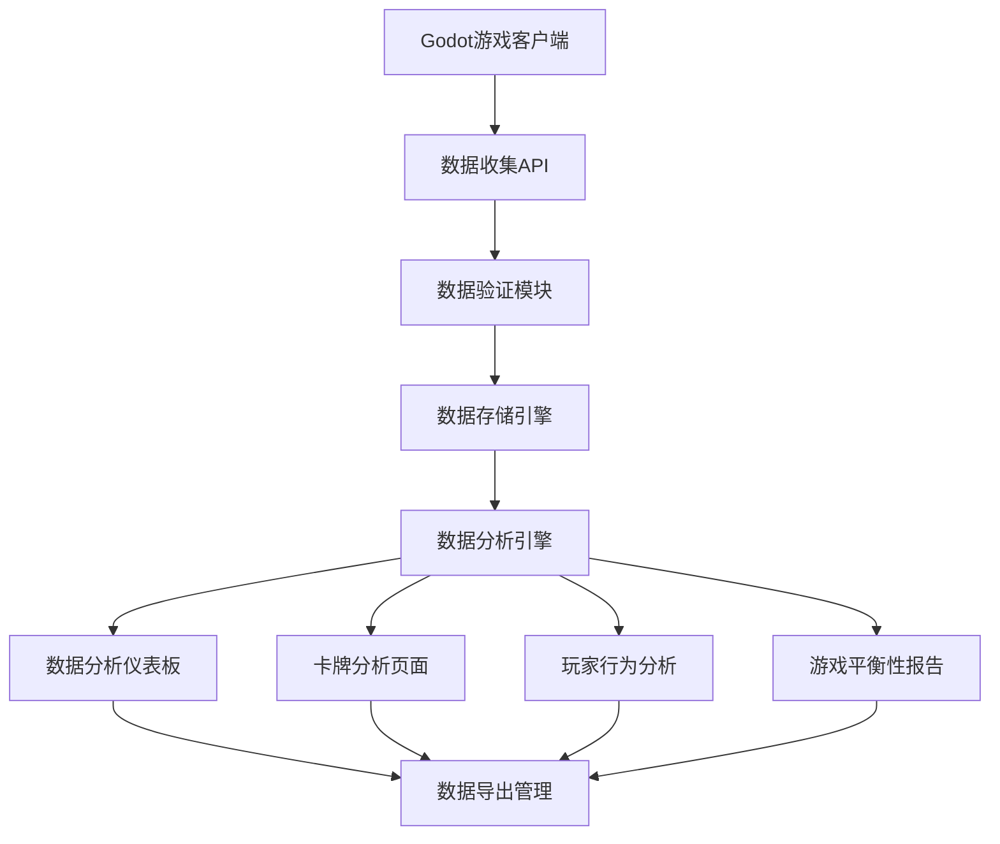

# CodeRogue 玩家数据分析服务 - 产品需求文档

## 1. 产品概述

本产品是为CodeRogue游戏开发的后端数据分析服务，旨在收集、存储和分析玩家的游戏行为数据，为游戏平衡性调整、内容优化和玩家体验改进提供数据支撑。

- 核心目标：通过数据驱动的方式优化游戏设计，提升玩家留存率和游戏体验
- 服务对象：游戏开发团队、数据分析师、产品经理
- 商业价值：提高游戏的可玩性和商业化潜力，降低游戏平衡性调整的试错成本

## 2. 核心功能

### 2.1 用户角色

| 角色 | 访问方式 | 核心权限 |
|------|----------|----------|
| 游戏客户端 | API密钥认证 | 上传游戏数据、查询基础统计 |
| 开发团队 | 管理后台登录 | 查看所有分析报告、导出数据、配置分析规则 |
| 数据分析师 | 专用分析界面 | 深度数据挖掘、自定义查询、生成分析报告 |

### 2.2 功能模块

本数据分析服务包含以下核心页面：

1. **数据收集接口**：游戏事件上报、批量数据同步、实时数据流处理
2. **数据分析仪表板**：核心指标展示、趋势分析图表、实时监控面板
3. **卡牌分析页面**：卡牌使用率统计、组合分析、平衡性评估
4. **玩家行为分析**：游戏流程分析、留存分析、付费行为分析
5. **游戏平衡性报告**：胜率分析、难度曲线、关卡通过率
6. **数据导出管理**：报告生成、数据导出、API文档

### 2.3 页面详情

| 页面名称 | 模块名称 | 功能描述 |
|----------|----------|----------|
| 数据收集接口 | 事件上报API | 接收游戏客户端发送的玩家行为事件，支持批量和实时上报 |
| 数据收集接口 | 数据验证模块 | 验证上报数据的完整性和合法性，过滤异常数据 |
| 数据收集接口 | 数据存储引擎 | 将验证后的数据存储到时序数据库和关系数据库 |
| 数据分析仪表板 | 核心指标面板 | 展示DAU、留存率、平均游戏时长等关键指标 |
| 数据分析仪表板 | 实时监控 | 监控服务器状态、数据上报频率、异常告警 |
| 数据分析仪表板 | 趋势分析图表 | 生成各类数据的时间序列图表和对比分析 |
| 卡牌分析页面 | 卡牌使用统计 | 统计各卡牌的选取率、使用频次、胜率贡献 |
| 卡牌分析页面 | 卡牌组合分析 | 分析热门卡牌组合、协同效应、反制关系 |
| 卡牌分析页面 | 平衡性评估 | 识别过强或过弱的卡牌，提供平衡性调整建议 |
| 玩家行为分析 | 游戏流程分析 | 追踪玩家在游戏中的路径、停留时间、流失点 |
| 玩家行为分析 | 留存分析 | 计算1日、7日、30日留存率，分析流失原因 |
| 玩家行为分析 | 付费行为分析 | 分析玩家付费模式、ARPU值、付费转化率 |
| 游戏平衡性报告 | 胜率分析 | 统计不同条件下的胜率分布，识别平衡性问题 |
| 游戏平衡性报告 | 难度曲线分析 | 分析关卡难度递进是否合理，优化游戏体验 |
| 游戏平衡性报告 | 关卡通过率 | 统计各关卡的通过率、重试次数、放弃率 |
| 数据导出管理 | 报告生成器 | 自动生成周报、月报，支持自定义报告模板 |
| 数据导出管理 | 数据导出工具 | 支持CSV、JSON、Excel格式的数据导出 |
| 数据导出管理 | API文档中心 | 提供完整的API文档和SDK，便于第三方集成 |

## 3. 核心流程

### 3.1 数据收集流程

1. **游戏客户端**在关键节点触发数据上报（如卡牌选择、战斗结束、关卡完成）
2. **数据收集API**接收并验证上报的数据格式和内容
3. **数据处理引擎**对原始数据进行清洗、转换和聚合
4. **存储系统**将处理后的数据分别存储到实时数据库和历史数据仓库
5. **分析引擎**定期对存储的数据进行统计分析和指标计算

### 3.2 数据分析流程

1. **开发团队**通过管理后台登录数据分析系统
2. **仪表板**展示核心指标的实时状态和历史趋势
3. **专项分析页面**提供深度的卡牌、玩家行为、平衡性分析
4. **报告生成**系统自动生成定期报告或支持自定义查询
5. **数据导出**支持将分析结果导出为多种格式供进一步处理

## 4. 用户界面设计

### 4.1 设计风格

- **主色调**：深蓝色(#1a365d)和科技蓝(#3182ce)，体现专业性和科技感
- **辅助色**：橙色(#ed8936)用于警告和重点标识，绿色(#38a169)用于成功状态
- **按钮样式**：扁平化设计，圆角矩形，悬停时有渐变效果
- **字体**：主要使用微软雅黑14px，标题使用16-20px加粗
- **布局风格**：卡片式布局，左侧导航栏，顶部面包屑导航
- **图标风格**：线性图标，统一使用Feather Icons图标库

### 4.2 页面设计概览

| 页面名称 | 模块名称 | UI元素 |
|----------|----------|--------|
| 数据分析仪表板 | 核心指标面板 | 大数字展示卡片，配色为蓝色渐变背景，白色文字，包含趋势箭头图标 |
| 数据分析仪表板 | 趋势分析图表 | 使用Chart.js库，线图和柱状图结合，配色遵循主题色系 |
| 数据分析仪表板 | 实时监控 | 状态指示灯(绿/黄/红)，数字滚动动画，WebSocket实时更新 |
| 卡牌分析页面 | 卡牌使用统计 | 表格展示，支持排序和筛选，热力图显示使用频率 |
| 卡牌分析页面 | 卡牌组合分析 | 网络图展示卡牌关系，节点大小表示使用频率，连线粗细表示组合强度 |
| 玩家行为分析 | 游戏流程分析 | 桑基图展示玩家流向，漏斗图显示转化率 |
| 玩家行为分析 | 留存分析 | 留存曲线图，支持分群对比，时间范围选择器 |
| 数据导出管理 | 报告生成器 | 拖拽式报告编辑器，预览功能，模板库 |

### 4.3 响应式设计

- **桌面优先**：主要面向PC端使用，最小支持1366x768分辨率
- **移动适配**：支持平板设备访问，关键指标在移动端可正常查看
- **触控优化**：按钮和交互元素支持触控操作，最小点击区域44px
