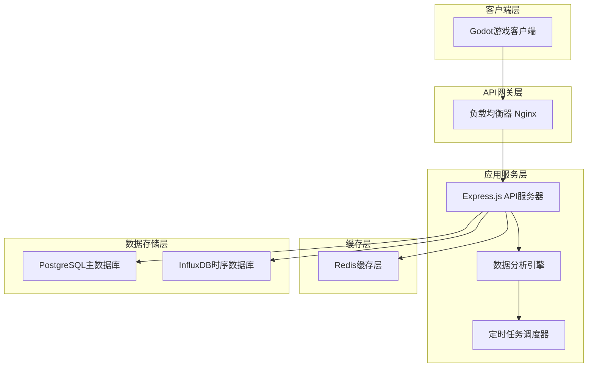
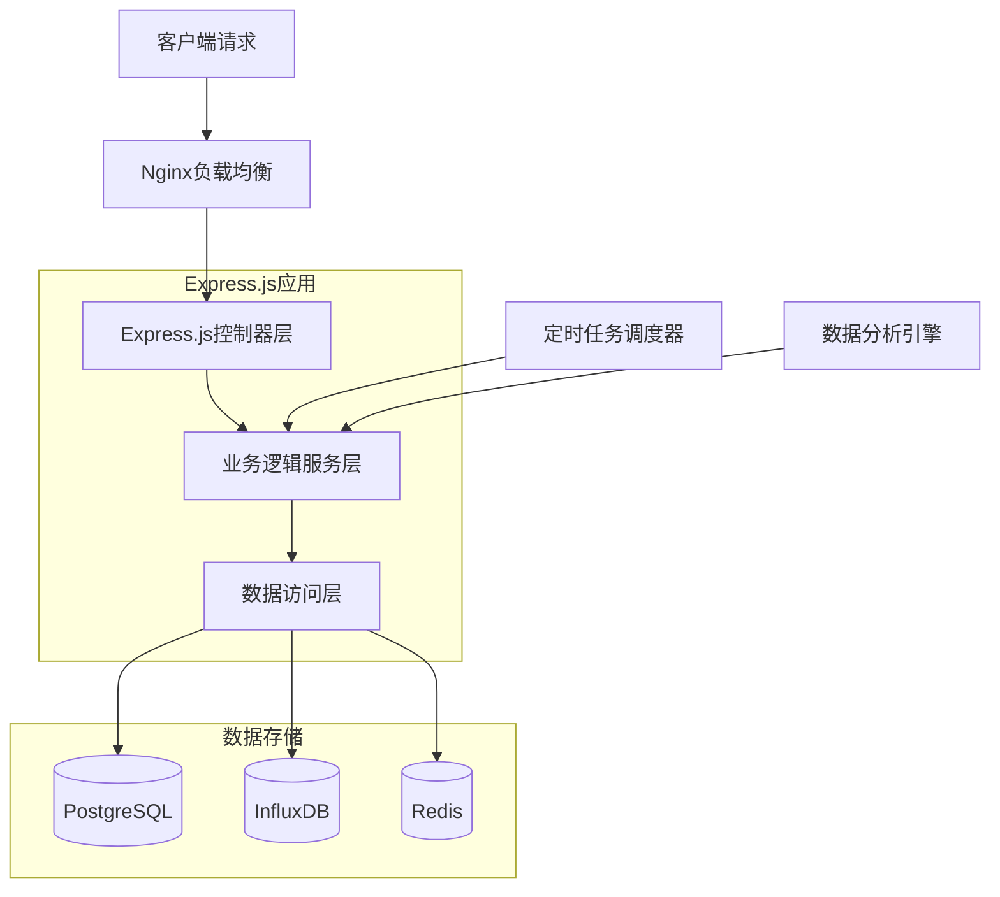
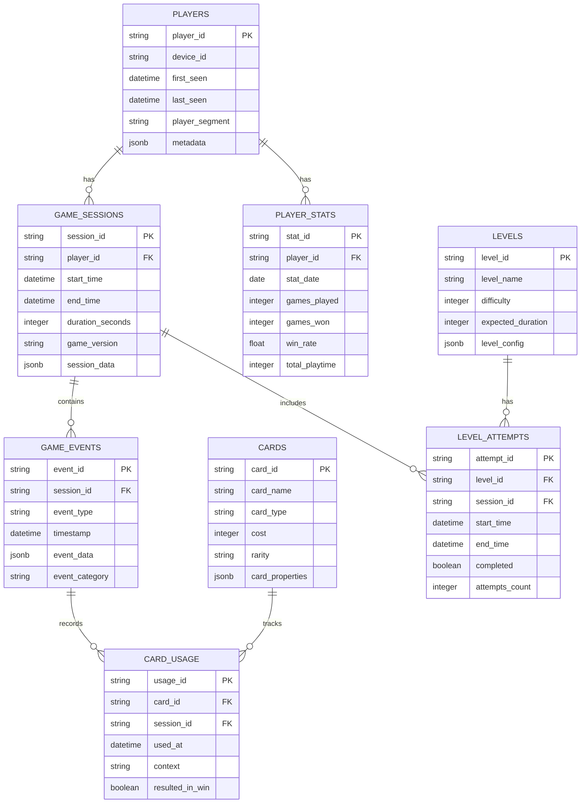

# CodeRogue 玩家数据分析服务 - 技术架构文档

## 1. 架构设计



## 2. 技术描述

- **前端**: React@18 + TypeScript + Chart.js + Ant Design
- **后端**: Express.js@4 + TypeScript + Node.js@18
- **数据库**: PostgreSQL@15 (主数据库) + InfluxDB@2.7 (时序数据)
- **缓存**: Redis@7
- **部署**: Docker + Docker Compose
- **监控**: Prometheus + Grafana

## 3. 路由定义

| 路由 | 用途 |
|------|------|
| /dashboard | 数据分析仪表板，展示核心指标和实时监控 |
| /cards | 卡牌分析页面，显示卡牌使用统计和组合分析 |
| /players | 玩家行为分析页面，包含留存分析和行为路径 |
| /balance | 游戏平衡性报告页面，展示胜率和难度分析 |
| /export | 数据导出管理页面，支持报告生成和数据下载 |
| /api-docs | API文档中心，提供完整的接口文档 |

## 4. API定义

### 4.1 核心API

#### 游戏数据上报接口
```
POST /api/v1/events
```

Request:
| 参数名称 | 参数类型 | 是否必需 | 描述 |
|----------|----------|----------|------|
| playerId | string | true | 玩家唯一标识符 |
| eventType | string | true | 事件类型(card_selected, battle_end, level_complete等) |
| eventData | object | true | 事件具体数据 |
| timestamp | number | true | 事件发生时间戳 |
| sessionId | string | true | 游戏会话ID |

Response:
| 参数名称 | 参数类型 | 描述 |
|----------|----------|------|
| success | boolean | 上报是否成功 |
| message | string | 响应消息 |
| eventId | string | 事件ID |

Example:
```json
{
  "playerId": "player_12345",
  "eventType": "card_selected",
  "eventData": {
    "cardId": "skill_001",
    "cardName": "火球术",
    "level": 3,
    "cost": 2
  },
  "timestamp": 1703123456789,
  "sessionId": "session_abc123"
}
```

#### 卡牌统计查询接口
```
GET /api/v1/analytics/cards
```

Request:
| 参数名称 | 参数类型 | 是否必需 | 描述 |
|----------|----------|----------|------|
| startDate | string | false | 开始日期(YYYY-MM-DD) |
| endDate | string | false | 结束日期(YYYY-MM-DD) |
| cardType | string | false | 卡牌类型筛选 |
| limit | number | false | 返回数量限制 |

Response:
| 参数名称 | 参数类型 | 描述 |
|----------|----------|------|
| cards | array | 卡牌统计数据列表 |
| totalCount | number | 总数量 |
| dateRange | object | 查询时间范围 |

Example:
```json
{
  "cards": [
    {
      "cardId": "skill_001",
      "cardName": "火球术",
      "selectionRate": 0.75,
      "winRate": 0.68,
      "usageCount": 15420
    }
  ],
  "totalCount": 156,
  "dateRange": {
    "start": "2024-01-01",
    "end": "2024-01-31"
  }
}
```

#### 玩家行为分析接口
```
GET /api/v1/analytics/players/behavior
```

Request:
| 参数名称 | 参数类型 | 是否必需 | 描述 |
|----------|----------|----------|------|
| metric | string | true | 分析指标(retention, session_length, progression等) |
| timeframe | string | false | 时间范围(7d, 30d, 90d) |
| segment | string | false | 玩家分群 |

Response:
| 参数名称 | 参数类型 | 描述 |
|----------|----------|------|
| metric | string | 分析指标名称 |
| data | array | 分析结果数据 |
| summary | object | 汇总统计 |

#### 游戏平衡性数据接口
```
GET /api/v1/analytics/balance
```

Request:
| 参数名称 | 参数类型 | 是否必需 | 描述 |
|----------|----------|----------|------|
| analysisType | string | true | 分析类型(winrate, difficulty, completion) |
| levelRange | string | false | 关卡范围 |
| playerSegment | string | false | 玩家群体 |

Response:
| 参数名称 | 参数类型 | 描述 |
|----------|----------|------|
| analysisType | string | 分析类型 |
| results | array | 分析结果 |
| recommendations | array | 平衡性建议 |

## 5. 服务器架构图



## 6. 数据模型

### 6.1 数据模型定义



### 6.2 数据定义语言

#### 玩家表 (players)
```sql
-- 创建玩家表
CREATE TABLE players (
    player_id VARCHAR(255) PRIMARY KEY,
    device_id VARCHAR(255),
    first_seen TIMESTAMP WITH TIME ZONE DEFAULT NOW(),
    last_seen TIMESTAMP WITH TIME ZONE DEFAULT NOW(),
    player_segment VARCHAR(50) DEFAULT 'new',
    metadata JSONB DEFAULT '{}',
    created_at TIMESTAMP WITH TIME ZONE DEFAULT NOW(),
    updated_at TIMESTAMP WITH TIME ZONE DEFAULT NOW()
);

-- 创建索引
CREATE INDEX idx_players_device_id ON players(device_id);
CREATE INDEX idx_players_last_seen ON players(last_seen DESC);
CREATE INDEX idx_players_segment ON players(player_segment);
```

#### 游戏会话表 (game_sessions)
```sql
-- 创建游戏会话表
CREATE TABLE game_sessions (
    session_id VARCHAR(255) PRIMARY KEY,
    player_id VARCHAR(255) REFERENCES players(player_id),
    start_time TIMESTAMP WITH TIME ZONE DEFAULT NOW(),
    end_time TIMESTAMP WITH TIME ZONE,
    duration_seconds INTEGER,
    game_version VARCHAR(50),
    session_data JSONB DEFAULT '{}',
    created_at TIMESTAMP WITH TIME ZONE DEFAULT NOW()
);

-- 创建索引
CREATE INDEX idx_sessions_player_id ON game_sessions(player_id);
CREATE INDEX idx_sessions_start_time ON game_sessions(start_time DESC);
CREATE INDEX idx_sessions_duration ON game_sessions(duration_seconds);
```

#### 游戏事件表 (game_events)
```sql
-- 创建游戏事件表
CREATE TABLE game_events (
    event_id VARCHAR(255) PRIMARY KEY,
    session_id VARCHAR(255) REFERENCES game_sessions(session_id),
    event_type VARCHAR(100) NOT NULL,
    timestamp TIMESTAMP WITH TIME ZONE DEFAULT NOW(),
    event_data JSONB DEFAULT '{}',
    event_category VARCHAR(50),
    created_at TIMESTAMP WITH TIME ZONE DEFAULT NOW()
);

-- 创建索引
CREATE INDEX idx_events_session_id ON game_events(session_id);
CREATE INDEX idx_events_type ON game_events(event_type);
CREATE INDEX idx_events_timestamp ON game_events(timestamp DESC);
CREATE INDEX idx_events_category ON game_events(event_category);
```

#### 卡牌表 (cards)
```sql
-- 创建卡牌表
CREATE TABLE cards (
    card_id VARCHAR(255) PRIMARY KEY,
    card_name VARCHAR(255) NOT NULL,
    card_type VARCHAR(100) NOT NULL,
    cost INTEGER DEFAULT 0,
    rarity VARCHAR(50) DEFAULT 'common',
    card_properties JSONB DEFAULT '{}',
    created_at TIMESTAMP WITH TIME ZONE DEFAULT NOW(),
    updated_at TIMESTAMP WITH TIME ZONE DEFAULT NOW()
);

-- 创建索引
CREATE INDEX idx_cards_type ON cards(card_type);
CREATE INDEX idx_cards_rarity ON cards(rarity);
CREATE INDEX idx_cards_cost ON cards(cost);
```

#### 卡牌使用记录表 (card_usage)
```sql
-- 创建卡牌使用记录表
CREATE TABLE card_usage (
    usage_id VARCHAR(255) PRIMARY KEY,
    card_id VARCHAR(255) REFERENCES cards(card_id),
    session_id VARCHAR(255) REFERENCES game_sessions(session_id),
    used_at TIMESTAMP WITH TIME ZONE DEFAULT NOW(),
    context VARCHAR(100),
    resulted_in_win BOOLEAN DEFAULT FALSE,
    created_at TIMESTAMP WITH TIME ZONE DEFAULT NOW()
);

-- 创建索引
CREATE INDEX idx_card_usage_card_id ON card_usage(card_id);
CREATE INDEX idx_card_usage_session_id ON card_usage(session_id);
CREATE INDEX idx_card_usage_used_at ON card_usage(used_at DESC);
CREATE INDEX idx_card_usage_win ON card_usage(resulted_in_win);
```

#### 初始化数据
```sql
-- 插入示例卡牌数据
INSERT INTO cards (card_id, card_name, card_type, cost, rarity, card_properties) VALUES
('skill_001', '火球术', 'attack', 2, 'common', '{"damage": 100, "element": "fire"}'),
('skill_002', '治疗术', 'heal', 1, 'common', '{"heal_amount": 50, "target": "self"}'),
('skill_003', '闪电链', 'attack', 3, 'rare', '{"damage": 80, "targets": 3, "element": "lightning"}'),
('skill_004', '护盾术', 'defense', 2, 'common', '{"shield_amount": 75, "duration": 3}'),
('skill_005', '冰冻术', 'control', 2, 'uncommon', '{"damage": 60, "freeze_duration": 2, "element": "ice"}');

-- 插入示例关卡数据
INSERT INTO levels (level_id, level_name, difficulty, expected_duration, level_config) VALUES
('level_001', '新手教程', 1, 300, '{"enemies": 3, "boss": false}'),
('level_002', '森林入口', 2, 450, '{"enemies": 5, "boss": false}'),
('level_003', '森林深处', 3, 600, '{"enemies": 7, "boss": true}'),
('level_004', '山洞探索', 4, 750, '{"enemies": 8, "boss": false}'),
('level_005', '山洞BOSS', 5, 900, '{"enemies": 10, "boss": true}');
```

## 7. Godot客户端集成方案

### 7.1 数据上报时机

- **游戏启动**：记录玩家设备信息、游戏版本
- **关卡开始**：记录关卡ID、玩家状态、选择的卡组
- **卡牌选择**：记录选择的卡牌、选择时机、可选项
- **战斗事件**：记录伤害、治疗、技能使用、状态变化
- **关卡结束**：记录胜负结果、用时、剩余资源
- **游戏退出**：记录游戏时长、退出原因

### 7.2 Godot端实现示例

```csharp
// 数据上报管理器
public partial class AnalyticsManager : Node
{
    private const string API_BASE_URL = "https://api.coderogue.com/v1";
    private string _playerId;
    private string _sessionId;
    private HttpRequest _httpRequest;
    
    public override void _Ready()
    {
        _httpRequest = new HttpRequest();
        AddChild(_httpRequest);
        _playerId = GetOrCreatePlayerId();
        _sessionId = Guid.NewGuid().ToString();
        
        // 游戏启动事件
        ReportEvent("game_start", new Dictionary<string, Variant>
        {
            ["game_version"] = ProjectSettings.GetSetting("application/config/version").AsString(),
            ["platform"] = OS.GetName()
        });
    }
    
    public void ReportCardSelection(string cardId, string cardName, int cost)
    {
        ReportEvent("card_selected", new Dictionary<string, Variant>
        {
            ["card_id"] = cardId,
            ["card_name"] = cardName,
            ["cost"] = cost,
            ["level_id"] = GameManager.CurrentLevelId
        });
    }
    
    public void ReportBattleEnd(bool victory, int duration, Dictionary<string, Variant> battleStats)
    {
        var eventData = new Dictionary<string, Variant>
        {
            ["victory"] = victory,
            ["duration_seconds"] = duration,
            ["level_id"] = GameManager.CurrentLevelId
        };
        
        foreach (var stat in battleStats)
        {
            eventData[stat.Key] = stat.Value;
        }
        
        ReportEvent("battle_end", eventData);
    }
    
    private void ReportEvent(string eventType, Dictionary<string, Variant> eventData)
    {
        var payload = new Dictionary<string, Variant>
        {
            ["playerId"] = _playerId,
            ["sessionId"] = _sessionId,
            ["eventType"] = eventType,
            ["eventData"] = eventData,
            ["timestamp"] = Time.GetUnixTimeFromSystem() * 1000
        };
        
        var json = Json.Stringify(payload);
        var headers = new[] { "Content-Type: application/json" };
        
        _httpRequest.Request($"{API_BASE_URL}/events", headers, HttpClient.Method.Post, json);
    }
    
    private string GetOrCreatePlayerId()
    {
        var playerId = ConfigManager.GetPlayerSetting("player_id", "").AsString();
        if (string.IsNullOrEmpty(playerId))
        {
            playerId = $"player_{Guid.NewGuid()}";
            ConfigManager.SetPlayerSetting("player_id", playerId);
        }
        return playerId;
    }
}
```

### 7.3 批量上报机制

为了减少网络请求频率和提高性能，实现批量上报机制：

```csharp
public partial class BatchAnalyticsManager : Node
{
    private List<Dictionary<string, Variant>> _eventQueue = new();
    private Timer _batchTimer;
    private const int BATCH_SIZE = 10;
    private const float BATCH_INTERVAL = 30.0f; // 30秒
    
    public override void _Ready()
    {
        _batchTimer = new Timer();
        _batchTimer.WaitTime = BATCH_INTERVAL;
        _batchTimer.Timeout += FlushEvents;
        _batchTimer.Autostart = true;
        AddChild(_batchTimer);
    }
    
    public void QueueEvent(string eventType, Dictionary<string, Variant> eventData)
    {
        _eventQueue.Add(CreateEventPayload(eventType, eventData));
        
        if (_eventQueue.Count >= BATCH_SIZE)
        {
            FlushEvents();
        }
    }
    
    private void FlushEvents()
    {
        if (_eventQueue.Count == 0) return;
        
        var batchPayload = new Dictionary<string, Variant>
        {
            ["events"] = _eventQueue.ToArray()
        };
        
        SendBatchRequest(batchPayload);
        _eventQueue.Clear();
    }
}
```
