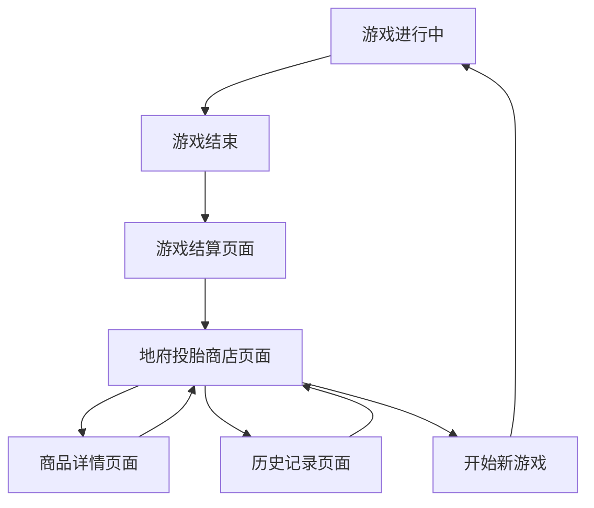

# 死亡重来系统（地府投胎商店）产品需求文档

## 1. 产品概述

死亡重来系统是CodeRogue游戏的核心Roguelike机制，玩家在游戏结束后进入地府投胎商店，将上一局的游戏成果转化为投胎币，用于购买下一局的开局优势和永久解锁内容。系统鼓励玩家尝试不同的卡牌、英雄、遗物组合，通过新颖度奖励机制提供额外货币收益。

该系统解决了传统Roguelike游戏中玩家失败后完全重置的挫败感问题，让每次游戏都有持续的进度积累，同时保持Roguelike的随机性和挑战性。

## 2. 核心功能

### 2.1 用户角色

| 角色 | 注册方法 | 核心权限 |
|------|----------|----------|
| 玩家 | 游戏启动自动创建 | 可进入投胎商店、购买商品、查看历史记录 |

### 2.2 功能模块

我们的死亡重来系统包含以下主要页面：
1. **游戏结算页面**：显示本局游戏统计、获得投胎币数量、新颖度奖励
2. **地府投胎商店页面**：商品展示、购买操作、货币显示、商品分类
3. **历史记录页面**：查看历史游戏数据、组合使用统计、成就进度
4. **商品详情页面**：商品描述、效果预览、购买确认

### 2.3 页面详情

| 页面名称 | 模块名称 | 功能描述 |
|----------|----------|----------|
| 游戏结算页面 | 结算统计模块 | 显示本局游戏时长、击败敌人数、使用卡牌统计、遗物收集情况 |
| 游戏结算页面 | 货币转换模块 | 计算并显示获得的投胎币数量，包括基础收益和新颖度奖励 |
| 游戏结算页面 | 新颖度评估模块 | 分析本局使用的卡牌、英雄、遗物组合的新颖程度，给予相应奖励倍率 |
| 地府投胎商店页面 | 商品展示模块 | 分类展示可购买商品，包括卡牌解锁、开局特权、永久升级等 |
| 地府投胎商店页面 | 购买系统模块 | 处理商品购买逻辑，扣除货币，解锁对应内容 |
| 地府投胎商店页面 | 货币显示模块 | 实时显示当前投胎币数量，购买后更新余额 |
| 历史记录页面 | 游戏历史模块 | 展示历史游戏记录，包括使用过的组合、达到的层数、游戏时长 |
| 历史记录页面 | 统计分析模块 | 显示各种卡牌、英雄、遗物的使用频率和成功率统计 |
| 商品详情页面 | 商品信息模块 | 详细描述商品效果、使用条件、持续时间等信息 |
| 商品详情页面 | 预览系统模块 | 提供商品效果的可视化预览，帮助玩家理解商品价值 |

## 3. 核心流程

### 3.1 死亡重来主流程

1. **游戏结束触发**：玩家角色死亡或主动退出游戏
2. **数据收集**：系统收集本局游戏数据（使用的卡牌、遗物、英雄、游戏时长、击败敌人等）
3. **新颖度计算**：分析本局组合的新颖程度，计算奖励倍率
4. **货币转换**：根据游戏表现和新颖度奖励计算获得的投胎币
5. **结算展示**：显示游戏统计和获得的投胎币
6. **进入商店**：玩家确认后进入地府投胎商店
7. **商品浏览**：玩家浏览可购买的商品
8. **购买决策**：玩家选择购买商品或保存货币
9. **开始新局**：购买完成后开始新的游戏局次

### 3.2 页面导航流程

## 4. 用户界面设计

### 4.1 设计风格

- **主色调**：深紫色(#2D1B69)和金色(#FFD700)，营造神秘的地府氛围
- **辅助色**：暗红色(#8B0000)和银色(#C0C0C0)
- **按钮风格**：古典风格的圆角按钮，带有金色边框和阴影效果
- **字体**：主标题使用18-24px的粗体字，正文使用14-16px的常规字体
- **布局风格**：卡片式布局，顶部导航栏，左侧商品分类，右侧详情展示
- **图标风格**：中国古典风格的图标，如铜钱、莲花、祥云等元素

### 4.2 页面设计概览

| 页面名称 | 模块名称 | UI元素 |
|----------|----------|--------|
| 游戏结算页面 | 结算统计模块 | 深色背景，金色文字，统计数据以卡片形式展示，包含图标和数值 |
| 游戏结算页面 | 货币转换模块 | 突出显示的投胎币图标，动画效果展示货币增加过程，新颖度奖励用特殊颜色标注 |
| 地府投胎商店页面 | 商品展示模块 | 网格布局展示商品卡片，每个卡片包含商品图标、名称、价格和简短描述 |
| 地府投胎商店页面 | 购买系统模块 | 购买按钮采用金色渐变，不可购买时显示为灰色，购买成功有粒子特效 |
| 历史记录页面 | 游戏历史模块 | 时间轴式布局，每条记录显示日期、使用组合、游戏结果，支持筛选和排序 |
| 商品详情页面 | 商品信息模块 | 大图展示商品，详细文字描述，效果数值用高亮颜色显示 |

### 4.3 响应式设计

系统采用桌面优先设计，针对1920x1080分辨率优化，支持16:9和16:10比例的显示器。界面元素采用相对布局，确保在不同分辨率下的良好显示效果。不考虑触屏操作，专注于鼠标和键盘交互体验。