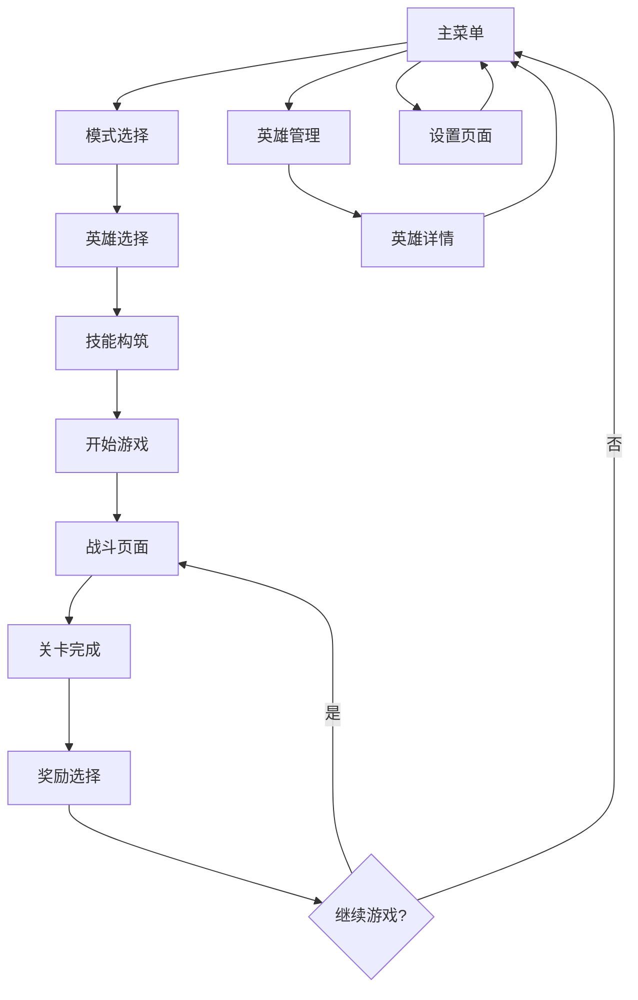

# Code Rogue: 代码深渊 - 产品需求文档

## 1. 产品概述

Code Rogue是一款结合Roguelike元素的创新打字游戏，玩家扮演被困在赛博空间的程序员，通过输入代码来战斗并逃离不断变化的数据迷宫。游戏采用现代几何图形风格，融合赛博朋克美学，为编程爱好者和打字游戏玩家提供紧张刺激的战斗体验。

产品旨在创造一个独特的打字-战斗融合体验，通过技能卡牌系统和程序生成内容，为玩家提供高重玩价值的Roguelike冒险。目标市场包括编程爱好者、打字游戏玩家、Roguelike爱好者和赛博朋克文化爱好者。

## 2. 核心功能

### 2.1 用户角色

| 角色 | 注册方式   | 核心权限                  |
| -- | ------ | --------------------- |
| 玩家 | 本地游戏启动 | 可进行游戏、保存进度、解锁内容、自定义设置 |

### 2.2 功能模块

我们的游戏需求包含以下主要页面：

1. **主菜单页面**：游戏启动界面、模式选择、设置入口
2. **游戏战斗页面**：核心打字战斗界面、技能轨道显示、状态信息
3. **英雄管理页面**：英雄收集展示、属性查看、灵魂链接设置
4. **技能构筑页面**：卡牌选择、轨道配置、羁绊效果预览
5. **进度系统页面**：成就查看、解锁内容、统计信息
6. **设置页面**：游戏设置、音频调节、主题切换

### 2.3 页面详情

| 页面名称   | 模块名称    | 功能描述                                    |
| ------ | ------- | --------------------------------------- |
| 主菜单页面  | 游戏模式选择  | 提供标准模式、深渊模式、练习模式等游戏入口                   |
| 主菜单页面  | 快速开始    | 使用默认配置快速进入游戏                            |
| 主菜单页面  | 设置入口    | 访问游戏设置和自定义选项                            |
| 游戏战斗页面 | 打字输入区域  | 显示当前需要输入的代码片段，处理键盘输入                    |
| 游戏战斗页面 | 技能轨道显示  | 展示4个技能轨道的充能状态和当前技能卡牌                    |
| 游戏战斗页面 | 战斗场景渲染  | 显示玩家角色、敌人位置、特效动画                        |
| 游戏战斗页面 | 状态信息HUD | 显示生命值、护盾、连击数、得分等实时信息                    |
| 英雄管理页面 | 英雄收藏展示  | 展示已解锁的英雄，显示品级和属性                        |
| 英雄管理页面 | 英雄详情查看  | 查看英雄的专属特性、技能加成、培养进度                     |
| 英雄管理页面 | 灵魂链接设置  | 配置主战英雄和链接英雄的组合                          |
| 技能构筑页面 | 卡牌库管理   | 查看和选择可用的技能卡牌                            |
| 技能构筑页面 | 轨道配置    | 设置4个技能轨道的卡牌分配和优先级                       |
| 技能构筑页面 | 羁绊效果预览  | 显示当前卡牌组合的羁绊效果和加成                        |
| 进度系统页面 | 成就系统    | 显示游戏成就的完成状态和奖励                          |
| 进度系统页面 | 解锁内容    | 展示已解锁的英雄、卡牌、主题等内容                       |
| 进度系统页面 | 统计信息    | 显示游戏时间、最高分数、通关记录等数据                     |
| 设置页面   | 游戏设置    | 调整难度、输入设置、显示选项                          |
| 设置页面   | 音频设置    | 调节音效音量、背景音乐、音频主题                        |
| 设置页面   | 视觉主题    | 切换色彩方案（Neon、Synthwave、Matrix、Cyberpunk） |

## 3. 核心流程

### 主要用户操作流程

**标准游戏流程**：

1. 玩家启动游戏进入主菜单
2. 选择游戏模式（标准模式/深渊模式/练习模式）
3. 进入英雄选择和技能构筑页面，配置战斗设置
4. 开始游戏，进入战斗页面
5. 通过打字输入进行战斗，技能轨道自动充能和释放
6. 完成关卡后获得奖励，可选择新的技能卡牌
7. 继续下一关卡或返回主菜单

**英雄培养流程**：

1. 从主菜单进入英雄管理页面
2. 查看已解锁的英雄和待解锁内容
3. 选择英雄查看详细属性和专属特性
4. 配置灵魂链接组合
5. 返回游戏应用新的英雄配置

**技能构筑流程**：

1. 从主菜单或游戏中进入技能构筑页面
2. 查看可用的技能卡牌库
3. 为4个技能轨道分配卡牌
4. 预览羁绊效果和构筑效率
5. 保存配置并应用到游戏中

## 4. 用户界面设计

### 4.1 设计风格

**主要色彩**：

* 主色调：深色背景 (#0a0a0a) 配合霓虹色彩

* 强调色：电蓝色 (#00ffff)、霓虹绿 (#00ff00)、警告红 (#ff0040)

* 辅助色：暗灰色 (#1a1a1a)、中灰色 (#333333)

**按钮样式**：

* 几何形状按钮，带有霓虹描边效果

* 悬停时发光动画，点击时脉冲效果

* 圆角矩形设计，符合现代UI美学

**字体设计**：

* 主要字体：等宽编程字体（如 Fira Code、Source Code Pro）

* 标题字体：未来感科技字体

* 字体大小：标题 24px，正文 16px，小字 12px

**布局风格**：

* 卡片式布局，模块化设计

* 顶部导航栏，侧边信息面板

* 网格系统，响应式布局

**图标和动画**：

* 几何图形图标，线条简洁

* 流光粒子效果，数据流动画

* 平滑过渡动画，微交互反馈

### 4.2 页面设计概览

| 页面名称   | 模块名称    | UI元素                      |
| ------ | ------- | ------------------------- |
| 主菜单页面  | 主导航区域   | 大型几何按钮，霓虹描边，悬停发光效果，背景粒子动画 |
| 主菜单页面  | 版本信息区域  | 半透明信息卡片，小字体显示，右下角定位       |
| 游戏战斗页面 | 中央战斗区域  | 深色背景，几何图形角色，粒子轨迹效果，动态光影   |
| 游戏战斗页面 | 技能轨道HUD | 底部工具栏，4个技能槽位，充能进度条，卡牌预览   |
| 游戏战斗页面 | 状态信息HUD | 顶部状态栏，生命值条，护盾指示器，连击计数器    |
| 英雄管理页面 | 英雄卡片网格  | 卡片式布局，品级色彩标识，3D翻转动画，属性预览  |
| 英雄管理页面 | 英雄详情面板  | 侧边滑出面板，属性图表，技能树可视化，链接设置   |
| 技能构筑页面 | 卡牌库区域   | 滚动卡片列表，分类标签，搜索过滤，拖拽交互     |
| 技能构筑页面 | 轨道配置区域  | 4个轨道槽位，拖拽放置，羁绊连线效果，效率计算显示 |
| 设置页面   | 设置分类标签  | 左侧标签导航，右侧设置面板，滑块和开关控件     |

### 4.3 响应式设计

游戏主要面向PC平台，采用桌面优先的设计策略：

* **主要分辨率**：1920x1080，支持1366x768到4K分辨率

* **界面缩放**：支持UI缩放设置，适应不同屏幕尺寸

* **输入优化**：专为键盘输入优化，支持自定义键位绑定

* **性能适配**：可调节特效质量，确保在低端设备上流畅运行

