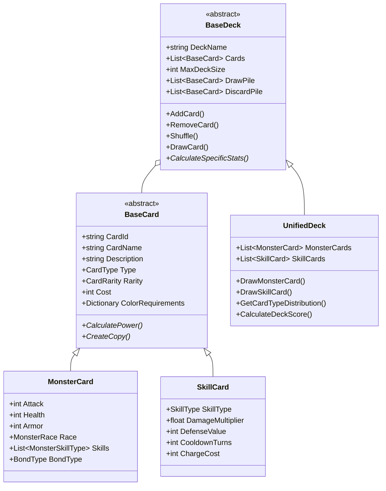
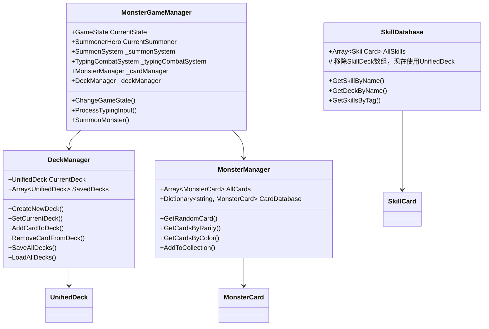
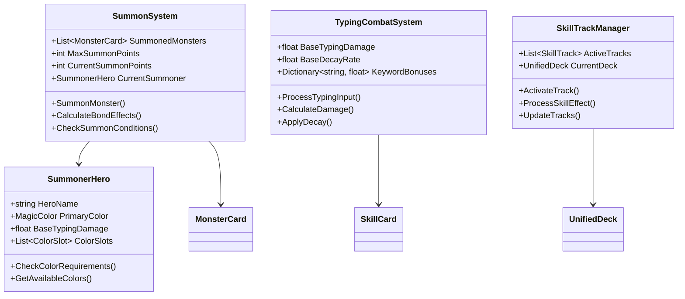
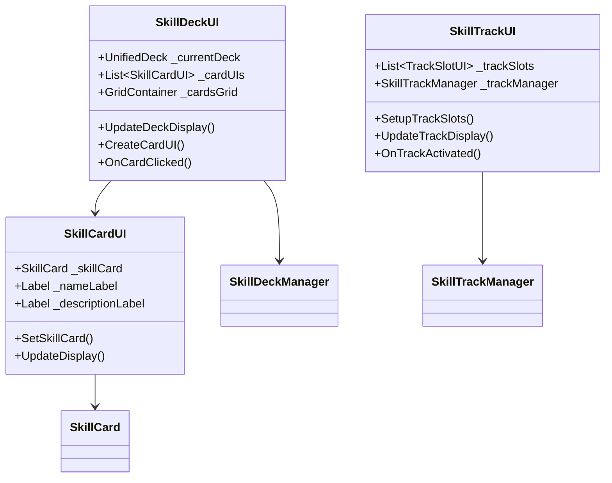
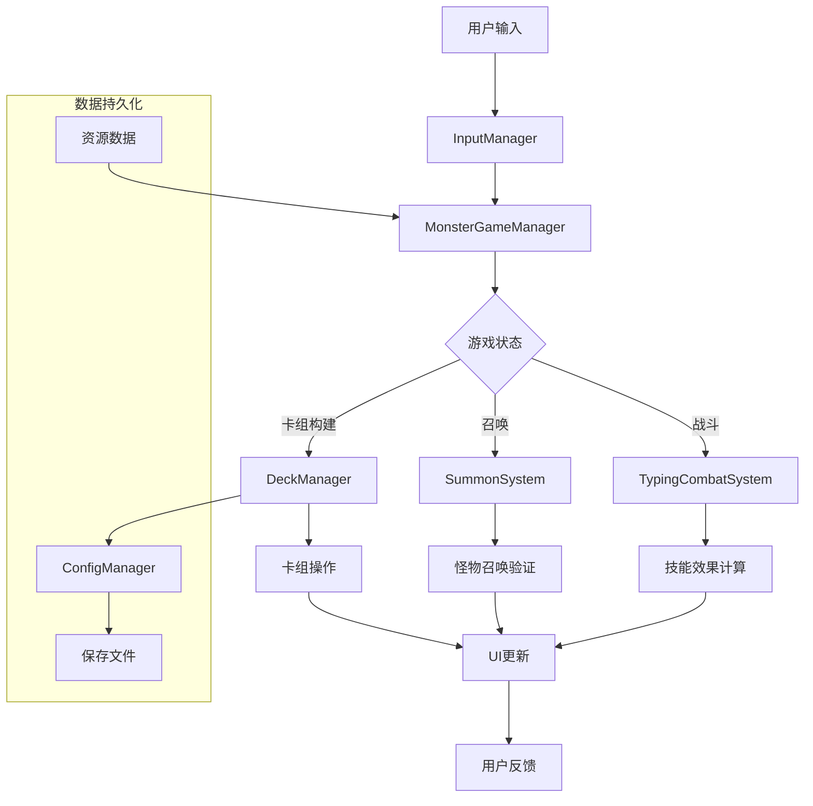

# CodeRogue 项目架构图

## 整体架构概览

```mermaid
graph TB
    subgraph "游戏入口层"
        Main[Main.tscn]
        MainMenu[MainMenu]
        GameUI[GameUI]
    end

    subgraph "核心管理层"
        GameManager[GameManager]
        MonsterGameManager[MonsterGameManager]
        AudioManager[AudioManager]
        ConfigManager[ConfigManager]
        InputManager[InputManager]
        UIManager[UIManager]
    end

    subgraph "卡牌系统"
        BaseCard[BaseCard - 抽象基类]
        MonsterCard[MonsterCard]
        SkillCard[SkillCard]
        
        BaseDeck[BaseDeck - 抽象基类]
        UnifiedDeck[UnifiedDeck]
        
        
        DeckManager[DeckManager]
    end

    subgraph "战斗系统"
        SummonSystem[SummonSystem]
        TypingCombatSystem[TypingCombatSystem]
        SummonerHero[SummonerHero]
        SkillTrackSystem[SkillTrackSystem]
        SkillTrackManager[SkillTrackManager]
        MonsterManager[MonsterManager]
    end

    subgraph "数据库层"
        SkillDatabase[SkillDatabase]
        HeroDatabase[HeroDatabase]
        RelicDatabase[RelicDatabase]
        BuffDatabase[BuffDatabase]
    end

    subgraph "增强系统"
        BuffManager[BuffManager]
        RelicManager[RelicManager]
        HeroManager[HeroManager]
    end

    subgraph "UI系统"
        SkillDeckUI[SkillDeckUI]
        SkillCardUI[SkillCardUI]
        SkillTrackUI[SkillTrackUI]
        GameOverScreen[GameOverScreen]
        PauseMenu[PauseMenu]
        SettingsMenu[SettingsMenu]
    end

    subgraph "工具系统"
        WordManager[WordManager]
        LevelManager[LevelManager]
    end

    subgraph "枚举定义"
        CardEnums[CardEnums]
        SkillEnums[SkillEnums]
        MonsterEnums[MonsterEnums]
        HeroEnums[HeroEnums]
        BuffEnums[BuffEnums]
    end

    %% 连接关系
    Main --> GameManager
    Main --> MonsterGameManager
    
    MonsterGameManager --> SummonSystem
    MonsterGameManager --> TypingCombatSystem
    MonsterGameManager --> MonsterManager
    MonsterGameManager --> DeckManager
    
    BaseCard --> MonsterCard
    BaseCard --> SkillCard
    
    BaseDeck --> UnifiedDeck
    
    DeckManager --> UnifiedDeck
    
    MonsterManager --> MonsterCard
    SkillDatabase --> SkillCard
    
    SummonSystem --> MonsterCard
    SummonSystem --> SummonerHero
    TypingCombatSystem --> SkillCard
    
    SkillTrackManager --> SkillTrackSystem
    SkillTrackManager --> UnifiedDeck
    
    BuffManager --> BuffDatabase
    RelicManager --> RelicDatabase
    HeroManager --> HeroDatabase
    
    SkillDeckUI --> DeckManager
    SkillCardUI --> SkillCard
    SkillTrackUI --> SkillTrackManager
    
    GameUI --> UIManager
    MainMenu --> UIManager
```

## 核心模块详细说明

### 1. 卡牌系统架构

### 2. 管理器系统架构

### 3. 战斗系统架构

### 4. UI系统架构

## 数据流向图

## 模块依赖关系

### 核心依赖
- **MonsterGameManager**: 整合所有系统的核心管理器
- **DeckManager**: 统一卡组管理，负责牌组的管理
- **BaseCard/BaseDeck**: 提供卡牌和卡组的抽象基础

### 系统间通信
- 使用Godot信号系统进行组件间通信
- 通过Manager类提供统一的API接口
- 数据库类提供静态数据访问

### 扩展性设计
- 抽象基类支持新卡牌类型扩展
- 插件式的增强系统（Buff、Relic、Hero）
- 模块化的UI组件设计

## 技术特点

1. **统一卡牌设计**: 所有卡牌继承自BaseCard，支持多种卡牌类型
2. **万智牌风格五色系统**: 完整的颜色需求和召唤师系统
3. **双重战斗系统**: 打字战斗 + 怪物召唤的创新结合
4. **统一卡组管理**: UnifiedDeck支持混合卡牌类型
5. **模块化架构**: 高内聚低耦合的系统设计
6. **信号驱动**: 基于Godot信号的事件系统
7. **数据持久化**: 完整的保存/加载系统
8. **类型安全**: 强类型的卡组和卡牌访问

## 开发状态

- ✅ 核心卡牌系统
- ✅ 统一卡组管理
- ✅ 战斗系统基础
- ✅ UI框架
- 🔄 增强系统集成
- 🔄 完整战斗流程
- ⏳ 动画和音效
- ⏳ AI和网络功能

---

*此架构图基于当前代码分析生成，展示了CodeRogue项目的完整技术架构和模块关系。*