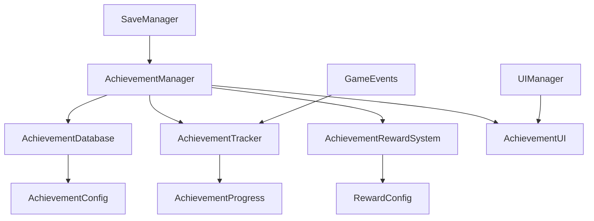

# CodeRogue 成就系统设计文档

## 1. 系统概述

成就系统是CodeRogue游戏中的重要功能模块，用于记录和奖励玩家在游戏中的各种成就和里程碑。该系统将与现有的技能系统、英雄系统、战斗系统等核心模块深度集成，为玩家提供长期的游戏目标和成就感。

### 1.1 核心目标
- 提供多样化的成就类型，覆盖游戏的各个方面
- 实时追踪玩家进度，及时反馈成就完成状态
- 提供有意义的奖励机制，增强游戏体验
- 与现有系统无缝集成，不影响游戏性能

### 1.2 设计原则
- **模块化设计**：成就系统独立于其他系统，通过事件机制进行通信
- **可扩展性**：支持动态添加新的成就类型和条件
- **性能优化**：采用高效的数据结构和算法，确保实时性
- **数据持久化**：成就进度和完成状态需要可靠保存

## 2. 系统架构

### 2.1 核心组件



### 2.2 组件职责

#### AchievementManager (Model层)
- 成就系统的核心管理器，继承自Node
- 负责成就的注册、追踪、完成检测
- 管理成就进度的保存和加载
- 处理成就完成后的奖励发放

#### AchievementDatabase (Model层)
- 成就配置数据库，继承自Node
- 从外部文件加载成就配置数据
- 提供成就查询和检索功能

#### AchievementTracker (Model层)
- 成就进度追踪器
- 监听游戏事件，更新相关成就进度
- 检测成就完成条件

#### AchievementRewardSystem (Model层)
- 成就奖励系统
- 处理成就完成后的奖励发放
- 支持多种奖励类型

#### AchievementUI (ViewModel层)
- 成就界面控制器
- 显示成就列表、进度、奖励等信息
- 处理用户交互

### 2.3 数据模型

#### AchievementConfig (继承自Resource)
```csharp
public partial class AchievementConfig : Resource
{
    [Export] public string Id { get; set; }
    [Export] public string Name { get; set; }
    [Export] public string Description { get; set; }
    [Export] public AchievementType Type { get; set; }
    [Export] public AchievementCategory Category { get; set; }
    [Export] public AchievementRarity Rarity { get; set; }
    [Export] public int TargetValue { get; set; }
    [Export] public string IconPath { get; set; }
    [Export] public RewardConfig[] Rewards { get; set; }
    [Export] public string[] Prerequisites { get; set; }
    [Export] public bool IsHidden { get; set; }
}
```

#### AchievementProgress (继承自Resource)
```csharp
public partial class AchievementProgress : Resource
{
    [Export] public string AchievementId { get; set; }
    [Export] public int CurrentValue { get; set; }
    [Export] public int TargetValue { get; set; }
    [Export] public bool IsCompleted { get; set; }
    [Export] public DateTime CompletedAt { get; set; }
    [Export] public bool IsRewardClaimed { get; set; }
}
```

## 3. 成就类型设计

### 3.1 成就分类

#### 按功能分类 (AchievementCategory)
- **Combat** - 战斗相关成就
- **Skill** - 技能相关成就
- **Hero** - 英雄相关成就
- **Collection** - 收集相关成就
- **Progress** - 进度相关成就
- **Special** - 特殊成就

#### 按类型分类 (AchievementType)
- **Counter** - 计数型成就（如击败100个敌人）
- **Milestone** - 里程碑成就（如达到某个等级）
- **Collection** - 收集型成就（如收集所有技能卡）
- **Sequence** - 序列型成就（如连续完成某个动作）
- **Condition** - 条件型成就（如在特定条件下完成任务）

#### 按稀有度分类 (AchievementRarity)
- **Common** - 普通成就
- **Rare** - 稀有成就
- **Epic** - 史诗成就
- **Legendary** - 传说成就

### 3.2 具体成就示例

#### 战斗类成就
- "初出茅庐" - 完成第一场战斗
- "百战百胜" - 连续获得100场胜利
- "一击必杀" - 单次攻击造成超过1000点伤害
- "不死之身" - 在一场战斗中承受超过5000点伤害但存活

#### 技能类成就
- "技能大师" - 学会所有基础技能
- "连击专家" - 在一回合内使用5个技能
- "元素掌控" - 同时拥有所有元素类型的技能

#### 英雄类成就
- "英雄收集家" - 解锁所有英雄
- "满级英雄" - 将一个英雄升级到最高等级
- "装备大师" - 为英雄装备满级装备

#### 收集类成就
- "卡牌收集家" - 收集所有技能卡
- "遗物猎人" - 收集所有遗物
- "完美主义者" - 100%完成游戏内容

## 4. 触发条件系统

### 4.1 事件监听机制

成就系统通过监听游戏事件来追踪玩家行为：

```csharp
public enum GameEventType
{
    EnemyDefeated,
    SkillUsed,
    HeroLevelUp,
    ItemCollected,
    LevelCompleted,
    DamageDealt,
    DamageReceived,
    ComboAchieved,
    // ... 更多事件类型
}
```

### 4.2 条件检测

每个成就都有特定的触发条件：

```csharp
public partial class AchievementCondition : Resource
{
    [Export] public GameEventType EventType { get; set; }
    [Export] public string ParameterName { get; set; }
    [Export] public Variant ParameterValue { get; set; }
    [Export] public ComparisonType Comparison { get; set; }
}
```

### 4.3 复合条件

支持多个条件的组合：
- **AND条件** - 所有条件都必须满足
- **OR条件** - 任一条件满足即可
- **序列条件** - 按特定顺序满足条件

## 5. 奖励系统

### 5.1 奖励类型

```csharp
public enum RewardType
{
    Experience,     // 经验值
    Gold,          // 金币
    SkillCard,     // 技能卡
    Hero,          // 英雄
    Relic,         // 遗物
    Title,         // 称号
    Avatar,        // 头像
    Badge,         // 徽章
    Unlock         // 解锁内容
}
```

### 5.2 奖励配置

```csharp
public partial class RewardConfig : Resource
{
    [Export] public RewardType Type { get; set; }
    [Export] public string ItemId { get; set; }
    [Export] public int Quantity { get; set; }
    [Export] public string Description { get; set; }
}
```

### 5.3 奖励发放机制

- **即时奖励** - 成就完成后立即发放
- **延迟奖励** - 需要玩家手动领取
- **累积奖励** - 多个成就的奖励可以累积

## 6. 进度追踪

### 6.1 实时更新

- 监听游戏事件，实时更新成就进度
- 使用高效的数据结构确保性能
- 支持批量更新以优化性能

### 6.2 进度保存

- 成就进度数据保存在GameData中
- 支持增量保存，避免频繁的完整保存
- 提供数据校验机制，防止数据损坏

### 6.3 进度同步

- UI界面实时显示最新进度
- 支持进度变化动画效果
- 提供进度完成的视觉反馈

## 7. 与现有系统集成

### 7.1 技能系统集成

- 监听技能使用事件
- 追踪技能学习进度
- 记录技能组合使用情况

### 7.2 英雄系统集成

- 监听英雄升级事件
- 追踪英雄收集进度
- 记录英雄装备情况

### 7.3 战斗系统集成

- 监听战斗结果事件
- 追踪伤害统计
- 记录战斗表现数据

### 7.4 保存系统集成

- 成就数据纳入GameData管理
- 支持成就数据的备份和恢复
- 提供数据迁移功能

## 8. 用户界面设计

### 8.1 成就列表界面

- 分类显示不同类型的成就
- 支持筛选和搜索功能
- 显示成就进度和完成状态
- 提供成就详情查看

### 8.2 成就通知系统

- 成就完成时显示通知
- 支持多种通知样式
- 可配置通知显示时长
- 提供音效反馈

### 8.3 成就详情界面

- 显示成就的详细信息
- 展示获得的奖励
- 提供分享功能
- 显示获得时间和条件

## 9. 性能优化

### 9.1 数据结构优化

- 使用Godot.Collections.Dictionary提高查询效率
- 采用索引机制加速成就检索
- 实现延迟加载减少内存占用

### 9.2 事件处理优化

- 使用事件池减少对象创建
- 批量处理相似事件
- 异步处理非关键事件

### 9.3 UI渲染优化

- 虚拟化长列表显示
- 缓存UI元素减少重复创建
- 优化动画效果性能

## 10. 扩展性设计

### 10.1 插件化架构

- 支持通过配置文件添加新成就
- 提供成就条件的扩展接口
- 支持自定义奖励类型

### 10.2 本地化支持

- 成就名称和描述支持多语言
- 提供本地化资源管理
- 支持动态语言切换

### 10.3 数据分析

- 记录成就完成统计数据
- 提供成就系统分析报告
- 支持A/B测试功能

## 11. 实现计划

### 11.1 第一阶段：核心框架

1. 创建成就相关的枚举类型
2. 实现AchievementConfig和AchievementProgress数据模型
3. 创建AchievementDatabase和AchievementManager
4. 实现基础的成就注册和查询功能

### 11.2 第二阶段：追踪系统

1. 实现AchievementTracker
2. 建立游戏事件监听机制
3. 实现成就条件检测逻辑
4. 添加进度更新和保存功能

### 11.3 第三阶段：奖励系统

1. 实现AchievementRewardSystem
2. 创建各种奖励类型的处理逻辑
3. 实现奖励发放和领取机制
4. 添加奖励验证和防作弊功能

### 11.4 第四阶段：用户界面

1. 创建AchievementUI界面
2. 实现成就列表和详情显示
3. 添加成就通知系统
4. 优化UI交互体验

### 11.5 第五阶段：集成测试

1. 与现有系统进行集成测试
2. 性能优化和bug修复
3. 添加示例成就配置
4. 完善文档和注释

## 12. 配置文件示例

### 12.1 成就配置文件 (AchievementConfigs.json)

```json
{
  "achievements": [
    {
      "id": "first_victory",
      "name": "初出茅庐",
      "description": "完成第一场战斗胜利",
      "type": "Milestone",
      "category": "Combat",
      "rarity": "Common",
      "targetValue": 1,
      "iconPath": "res://Icons/Achievements/first_victory.png",
      "rewards": [
        {
          "type": "Experience",
          "quantity": 100,
          "description": "获得100点经验值"
        },
        {
          "type": "Gold",
          "quantity": 50,
          "description": "获得50金币"
        }
      ],
      "prerequisites": [],
      "isHidden": false,
      "conditions": [
        {
          "eventType": "BattleWon",
          "parameterName": "count",
          "parameterValue": 1,
          "comparison": "GreaterOrEqual"
        }
      ]
    },
    {
      "id": "skill_master",
      "name": "技能大师",
      "description": "学会所有基础技能",
      "type": "Collection",
      "category": "Skill",
      "rarity": "Epic",
      "targetValue": 20,
      "iconPath": "res://Icons/Achievements/skill_master.png",
      "rewards": [
        {
          "type": "SkillCard",
          "itemId": "legendary_skill_001",
          "quantity": 1,
          "description": "获得传说技能卡"
        },
        {
          "type": "Title",
          "itemId": "skill_master_title",
          "quantity": 1,
          "description": "获得'技能大师'称号"
        }
      ],
      "prerequisites": ["first_skill_learned"],
      "isHidden": false,
      "conditions": [
        {
          "eventType": "SkillLearned",
          "parameterName": "uniqueSkillCount",
          "parameterValue": 20,
          "comparison": "GreaterOrEqual"
        }
      ]
    }
  ]
}
```

## 13. 总结

成就系统将为CodeRogue游戏增加重要的长期目标和成就感，通过与现有系统的深度集成，为玩家提供丰富的游戏体验。系统采用模块化设计，具有良好的扩展性和可维护性，能够满足未来功能扩展的需求。

通过分阶段的实现计划，可以确保系统的稳定性和质量，同时为后续的功能迭代奠定坚实的基础。