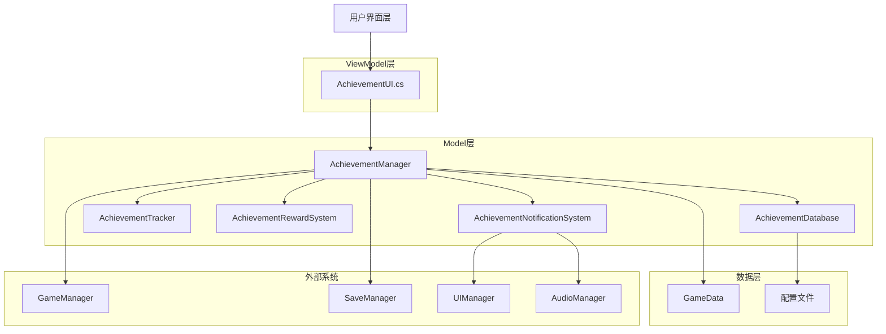
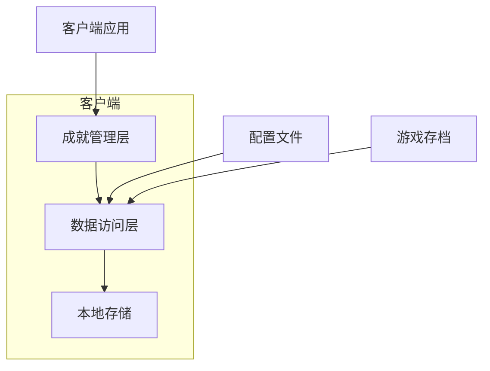
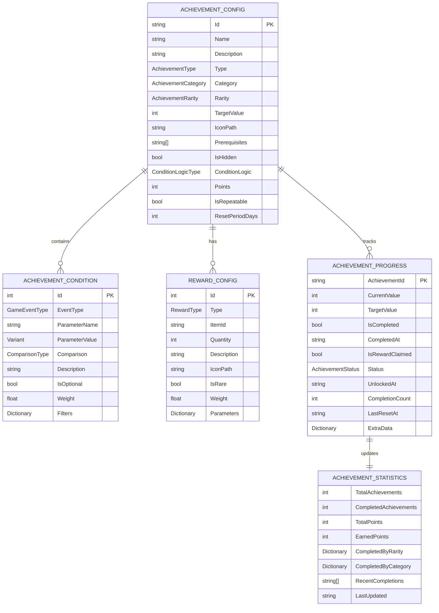

# CodeRogue 成就系统技术架构文档

## 1. 架构设计



## 2. 技术描述

* **前端**: Godot 4.4+ C# + .tscn场景文件

* **后端**: 无（单机游戏）

* **数据存储**: Godot GameData系统 + JSON配置文件

* **事件系统**: Godot信号系统

* **UI框架**: Godot UI系统

## 3. 路由定义

成就系统作为游戏内功能模块，通过以下方式访问：

| 访问路径         | 功能描述       |
| ------------ | ---------- |
| 主菜单 -> 成就    | 从主菜单进入成就界面 |
| 游戏内菜单 -> 成就  | 游戏过程中查看成就  |
| 成就通知         | 成就完成时的弹窗通知 |
| 设置菜单 -> 成就设置 | 成就相关设置选项   |

## 4. API定义

### 4.1 核心API

#### 成就管理相关

**获取所有成就**

```csharp
public AchievementConfig[] GetAllAchievements()
```

参数: 无

返回值:

| 参数名          | 参数类型                 | 描述       |
| ------------ | -------------------- | -------- |
| achievements | AchievementConfig\[] | 所有成就配置数组 |

**获取成就进度**

```csharp
public AchievementProgress GetAchievementProgress(string achievementId)
```

参数:

| 参数名           | 参数类型   | 是否必需 | 描述   |
| ------------- | ------ | ---- | ---- |
| achievementId | string | true | 成就ID |

返回值:

| 参数名      | 参数类型                | 描述     |
| -------- | ------------------- | ------ |
| progress | AchievementProgress | 成就进度信息 |

**更新成就进度**

```csharp
public bool UpdateAchievementProgress(string achievementId, int value)
```

参数:

| 参数名           | 参数类型   | 是否必需 | 描述   |
| ------------- | ------ | ---- | ---- |
| achievementId | string | true | 成就ID |
| value         | int    | true | 进度值  |

返回值:

| 参数名     | 参数类型 | 描述     |
| ------- | ---- | ------ |
| success | bool | 是否更新成功 |

**完成成就**

```csharp
public bool CompleteAchievement(string achievementId)
```

参数:

| 参数名           | 参数类型   | 是否必需 | 描述   |
| ------------- | ------ | ---- | ---- |
| achievementId | string | true | 成就ID |

返回值:

| 参数名     | 参数类型 | 描述     |
| ------- | ---- | ------ |
| success | bool | 是否完成成功 |

#### 事件处理相关

**处理游戏事件**

```csharp
public void HandleGameEvent(AchievementEventData eventData)
```

参数:

| 参数名       | 参数类型                 | 是否必需 | 描述     |
| --------- | -------------------- | ---- | ------ |
| eventData | AchievementEventData | true | 游戏事件数据 |

**注册事件监听器**

```csharp
public void RegisterEventListener(GameEventType eventType, Action<AchievementEventData> callback)
```

参数:

| 参数名       | 参数类型                         | 是否必需 | 描述   |
| --------- | ---------------------------- | ---- | ---- |
| eventType | GameEventType                | true | 事件类型 |
| callback  | Action<AchievementEventData> | true | 回调函数 |

#### 奖励系统相关

**领取成就奖励**

```csharp
public RewardResult ClaimAchievementReward(string achievementId)
```

参数:

| 参数名           | 参数类型   | 是否必需 | 描述   |
| ------------- | ------ | ---- | ---- |
| achievementId | string | true | 成就ID |

返回值:

| 参数名    | 参数类型         | 描述     |
| ------ | ------------ | ------ |
| result | RewardResult | 奖励领取结果 |

**获取可领取奖励列表**

```csharp
public string[] GetClaimableRewards()
```

返回值:

| 参数名            | 参数类型      | 描述           |
| -------------- | --------- | ------------ |
| achievementIds | string\[] | 可领取奖励的成就ID数组 |

### 4.2 信号定义

```csharp
// 成就完成信号
[Signal]
public delegate void AchievementCompletedEventHandler(string achievementId);

// 成就进度更新信号
[Signal]
public delegate void AchievementProgressUpdatedEventHandler(string achievementId, int currentValue, int targetValue);

// 成就解锁信号
[Signal]
public delegate void AchievementUnlockedEventHandler(string achievementId);

// 奖励领取信号
[Signal]
public delegate void RewardClaimedEventHandler(string achievementId, RewardConfig[] rewards);

// 成就通知信号
[Signal]
public delegate void AchievementNotificationEventHandler(AchievementNotification notification);
```

## 5. 服务器架构图

由于CodeRogue是单机游戏，不涉及服务器架构。成就系统完全在客户端运行：



## 6. 数据模型

### 6.1 数据模型定义



### 6.2 数据定义语言

#### 成就配置表 (AchievementConfigs.json)

```json
{
  "achievements": [
    {
      "id": "first_victory",
      "name": "初出茅庐",
      "description": "完成第一场战斗胜利",
      "type": "Milestone",
      "category": "Combat",
      "rarity": "Common",
      "targetValue": 1,
      "iconPath": "res://Icons/Achievements/first_victory.png",
      "rewards": [
        {
          "type": "Experience",
          "quantity": 100,
          "description": "获得100点经验值"
        }
      ],
      "prerequisites": [],
      "isHidden": false,
      "conditions": [
        {
          "eventType": "BattleWon",
          "parameterName": "count",
          "parameterValue": 1,
          "comparison": "GreaterOrEqual"
        }
      ],
      "conditionLogic": "And",
      "points": 10,
      "isRepeatable": false,
      "resetPeriodDays": 0
    }
  ]
}
```

#### 成就进度数据 (在GameData中)

```csharp
// GameData.cs中添加
[Export] public Dictionary<string, AchievementProgress> AchievementProgresses { get; set; } = new Dictionary<string, AchievementProgress>();
[Export] public AchievementStatistics AchievementStats { get; set; } = new AchievementStatistics();
```

#### 初始化数据

```csharp
// AchievementDatabase.cs中的初始化方法
public void LoadConfigs()
{
    var configPath = "res://ResourcesData/AchievementConfigs.json";
    if (FileAccess.FileExists(configPath))
    {
        using var file = FileAccess.Open(configPath, FileAccess.ModeFlags.Read);
        var jsonString = file.GetAsText();
        var json = Json.ParseString(jsonString);
        
        if (json.AsGodotDictionary().TryGetValue("achievements", out var achievementsData))
        {
            var achievementsArray = achievementsData.AsGodotArray();
            foreach (var achievementData in achievementsArray)
            {
                var config = ParseAchievementConfig(achievementData.AsGodotDictionary());
                _achievements[config.Id] = config;
            }
        }
    }
    
    GD.Print($"Loaded {_achievements.Count} achievement configurations");
}
```

## 7. 类结构设计

### 7.1 核心类层次结构

```
Node (Godot)
├── AchievementManager
├── AchievementDatabase
├── AchievementTracker
├── AchievementRewardSystem
└── AchievementNotificationSystem

Control (Godot)
└── AchievementUI

Resource (Godot)
├── AchievementConfig
├── AchievementProgress
├── RewardConfig
├── AchievementCondition
├── AchievementEventData
├── AchievementNotification
└── AchievementStatistics
```

### 7.2 接口定义

```csharp
// 成就追踪器接口
public interface IAchievementTracker
{
    void TrackEvent(AchievementEventData eventData);
    void RegisterConditionChecker(GameEventType eventType, Func<AchievementEventData, AchievementCondition, bool> checker);
    bool CheckCondition(AchievementCondition condition, AchievementEventData eventData);
}

// 奖励系统接口
public interface IRewardSystem
{
    RewardResult GrantReward(RewardConfig reward);
    bool CanGrantReward(RewardConfig reward);
    void ValidateReward(RewardConfig reward);
}

// 通知系统接口
public interface INotificationSystem
{
    void ShowNotification(AchievementNotification notification);
    void QueueNotification(AchievementNotification notification);
    void ClearNotifications();
}
```

## 8. 性能优化策略

### 8.1 数据结构优化

* **索引优化**: 使用Dictionary\<string, AchievementConfig>提供O(1)查询性能

* **缓存机制**: 缓存频繁访问的成就进度数据

* **延迟加载**: 成就图标和详细信息按需加载

### 8.2 事件处理优化

* **事件过滤**: 只处理相关的游戏事件

* **批量处理**: 合并相似事件减少处理次数

* **异步处理**: 非关键事件异步处理避免阻塞主线程

### 8.3 UI渲染优化

* **虚拟列表**: 大量成就列表使用虚拟滚动

* **对象池**: 重用UI元素减少创建销毁开销

* **LOD系统**: 根据距离调整成就图标质量

## 9. 安全性考虑

### 9.1 数据完整性

* **校验机制**: 成就进度数据加载时进行完整性校验

* **备份策略**: 定期备份成就数据防止丢失

* **版本控制**: 支持成就数据格式版本升级

### 9.2 防作弊机制

* **数据验证**: 成就完成条件严格验证

* **时间戳检查**: 验证成就完成时间的合理性

* **进度限制**: 防止异常的进度跳跃

## 10. 测试策略

### 10.1 单元测试

* **条件检测测试**: 验证各种成就条件的正确性

* **进度更新测试**: 测试进度计算和更新逻辑

* **奖励发放测试**: 验证奖励系统的正确性

### 10.2 集成测试

* **系统集成测试**: 测试与其他游戏系统的集成

* **数据持久化测试**: 验证数据保存和加载功能

* **性能测试**: 测试大量成就时的系统性能

### 10.3 用户体验测试

* **UI响应测试**: 验证界面操作的流畅性

* **通知系统测试**: 测试成就通知的及时性和准确性

* **可用性测试**: 验证成就系统的易用性

## 11. 部署和维护

### 11.1 配置管理

* **配置文件版本控制**: 成就配置文件纳入版本管理

* **热更新支持**: 支持运行时重新加载成就配置

* **A/B测试**: 支持不同成就配置的A/B测试

### 11.2 监控和日志

* **性能监控**: 监控成就系统的性能指标

* **错误日志**: 记录成就系统的错误和异常

* **统计数据**: 收集成就完成率等统计信息

### 11.3 维护工具

* **成就编辑器**: 可视化的成就配置编辑工具

* **数据迁移工具**: 支持成就数据格式升级

* **调试工具**: 开发阶段的成就系统调试工具

## 12. 扩展性设计

### 12.1 插件化架构

* **条件插件**: 支持自定义成就条件类型

* **奖励插件**: 支持自定义奖励类型

* **通知插件**: 支持自定义通知样式

### 12.2 多平台支持

* **平台适配**: 支持不同平台的成就系统

* **云同步**: 预留云端同步接口

* **社交功能**: 预留成就分享功能接口

### 12.3 国际化支持

* **多语言**: 成就名称和描述支持多语言

* **本地化**: 支持不同地区的成就配置

* **文化适配**: 考虑不同文化背景的成就设计

