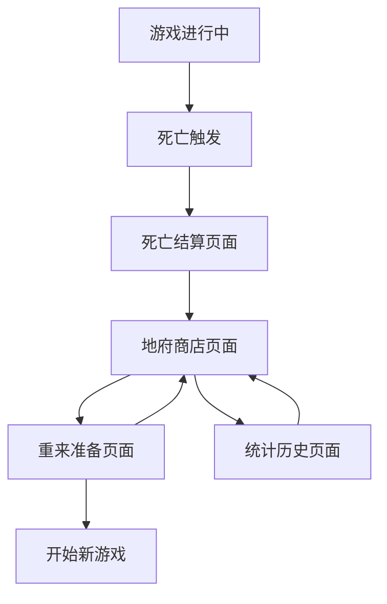

# CodeRogue 死亡重来系统设计文档

## 1. 产品概述

死亡重来系统是CodeRogue的核心rouge-like机制，当玩家在一局游戏中死亡后，将进入赛博修仙时代的地府投胎商店。玩家可以将上局游戏的收获转化为商店货币，购买各种增强道具和特权，为下一次轮回做准备。

系统鼓励玩家尝试不同的卡牌、英雄和遗物组合，通过奖励机制促进游戏的可重玩性和策略多样性。

## 2. 核心功能

### 2.1 用户角色

| 角色 | 描述 | 核心权限 |
|------|------|----------|
| 玩家 | 游戏的主要参与者 | 可以进行游戏、死亡重来、购买商品、查看统计 |
| 地府商店管理员 | NPC角色 | 提供商品介绍、处理交易、发放奖励 |

### 2.2 功能模块

我们的死亡重来系统包含以下主要页面：

1. **死亡结算页面**：显示本局游戏统计、货币转换详情、奖励计算
2. **地府商店页面**：展示可购买商品、玩家货币余额、商品详情
3. **重来准备页面**：选择购买的增强效果、确认下局开始配置
4. **统计历史页面**：查看历史轮回记录、解锁成就、组合奖励统计

### 2.3 页面详情

| 页面名称 | 模块名称 | 功能描述 |
|----------|----------|----------|
| 死亡结算页面 | 游戏统计模块 | 显示本局游戏时长、击败敌人数量、收集卡牌数量、获得遗物列表 |
| 死亡结算页面 | 货币转换模块 | 将卡牌、遗物、游戏进度转换为地府货币，显示转换比例和总额 |
| 死亡结算页面 | 奖励计算模块 | 计算新组合奖励、连胜奖励、成就奖励等额外货币 |
| 地府商店页面 | 商品展示模块 | 分类展示卡牌使用权、开局特权、永久增强等商品 |
| 地府商店页面 | 购买交易模块 | 处理商品购买、货币扣除、库存管理、购买确认 |
| 地府商店页面 | 商品详情模块 | 显示商品效果描述、价格信息、使用条件、稀有度 |
| 重来准备页面 | 配置选择模块 | 选择已购买的增强效果、设置下局开始参数 |
| 重来准备页面 | 预览确认模块 | 预览下局开始状态、确认配置、开始新游戏 |
| 统计历史页面 | 轮回记录模块 | 显示历史游戏记录、最佳成绩、死亡原因统计 |
| 统计历史页面 | 成就系统模块 | 显示解锁成就、进度追踪、成就奖励 |
| 统计历史页面 | 组合统计模块 | 记录使用过的卡牌英雄遗物组合、奖励历史 |

## 3. 核心流程

### 3.1 死亡重来主流程

1. **游戏结束触发**：玩家生命值归零或满足其他失败条件
2. **进入死亡结算**：计算本局收获，转换为地府货币
3. **奖励计算**：检查新组合使用情况，发放额外奖励
4. **进入地府商店**：展示可购买商品和玩家货币余额
5. **商品购买**：玩家选择并购买所需商品
6. **重来准备**：配置下局开始状态和增强效果
7. **开始新游戏**：应用购买的增强效果，开始新的轮回

### 3.2 页面导航流程图

## 4. 用户界面设计

### 4.1 设计风格

- **主色调**：深紫色(#2D1B69)和金色(#FFD700)，营造神秘的地府氛围
- **辅助色**：暗红色(#8B0000)和银色(#C0C0C0)
- **按钮风格**：古典风格的圆角矩形，带有发光效果
- **字体**：中等大小的无衬线字体，重要信息使用加粗
- **布局风格**：卡片式布局，顶部导航栏设计
- **图标风格**：线条简洁的矢量图标，配合古典元素

### 4.2 页面设计概览

| 页面名称 | 模块名称 | UI元素 |
|----------|----------|--------|
| 死亡结算页面 | 统计展示区域 | 使用卡片布局展示游戏数据，深色背景配金色边框，数据用大号字体突出显示 |
| 死亡结算页面 | 货币转换区域 | 动画效果展示转换过程，使用进度条和数字滚动效果，金色货币图标 |
| 地府商店页面 | 商品网格区域 | 3x4网格布局展示商品卡片，每个卡片包含图标、名称、价格和稀有度标识 |
| 地府商店页面 | 货币显示区域 | 顶部固定显示当前货币数量，使用大号金色字体和货币图标动画 |
| 重来准备页面 | 增强效果列表 | 垂直列表展示已购买的增强效果，每项包含图标、描述和开关按钮 |
| 统计历史页面 | 数据图表区域 | 使用柱状图和折线图展示历史数据，配色与主题保持一致 |

### 4.3 响应式设计

系统采用桌面优先设计，支持1920x1080及以上分辨率，界面元素支持缩放适配不同屏幕尺寸。重要按钮和文字保持足够大小确保可读性。