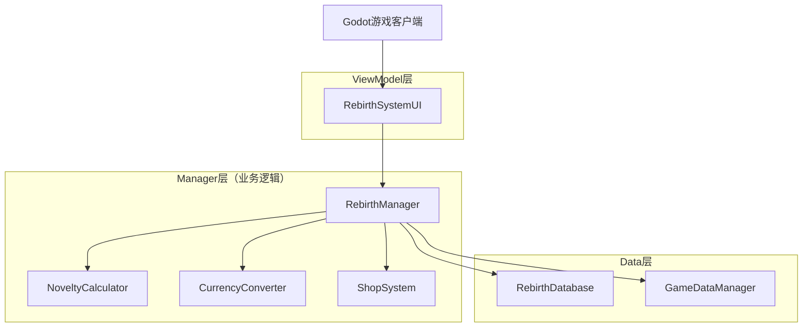
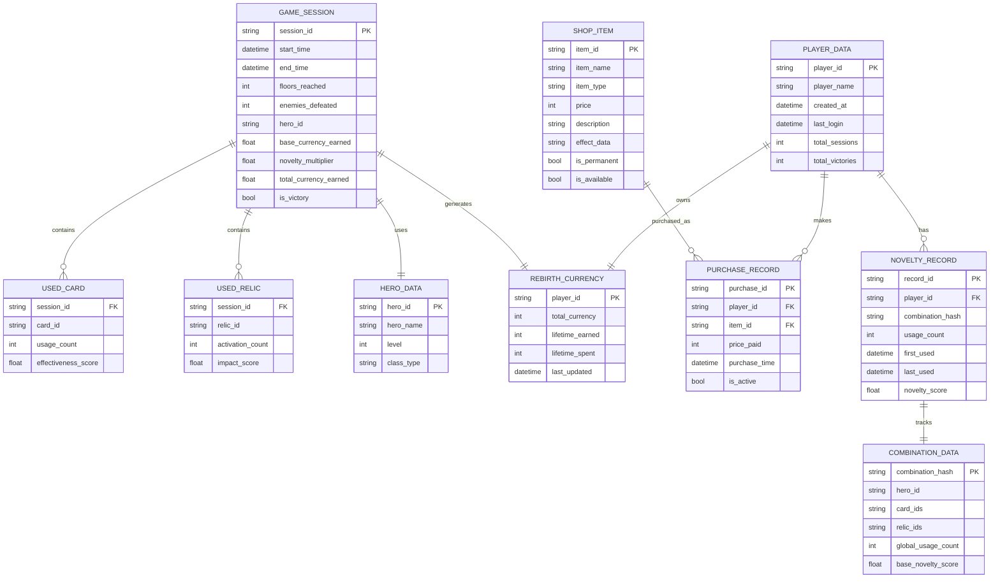

# 死亡重来系统技术架构文档

## 1. 架构设计



## 2. 技术描述

* Frontend: Godot 4.4+ (C# + GDScript)

* Backend: 无（单机游戏）

* Database: Godot Resource系统 + JSON文件存储

* Architecture: MVVM模式

## 3. 路由定义

| 场景路径                                        | 用途                   |
| ------------------------------------------- | -------------------- |
| /Scenes/UI/Rebirth/GameResultScene.tscn     | 游戏结算页面，显示本局统计和获得的投胎币 |
| /Scenes/UI/Rebirth/RebirthShopScene.tscn    | 地府投胎商店主页面，商品展示和购买    |
| /Scenes/UI/Rebirth/HistoryRecordScene.tscn  | 历史记录页面，查看过往游戏数据      |
| /Scenes/UI/Rebirth/ShopItemDetailScene.tscn | 商品详情页面，显示商品详细信息      |
| /Scenes/UI/Rebirth/RebirthMainScene.tscn    | 重生系统主入口场景            |

## 4. 数据模型

### 4.1 数据模型定义



### 4.2 数据定义语言

#### 游戏会话表 (game\_sessions)

```csharp
// GameSession.cs - 游戏会话数据
[System.Serializable]
public class GameSession : Resource
{
    [Export] public string SessionId { get; set; } = System.Guid.NewGuid().ToString();
    [Export] public DateTime StartTime { get; set; }
    [Export] public DateTime EndTime { get; set; }
    [Export] public int FloorsReached { get; set; }
    [Export] public int EnemiesDefeated { get; set; }
    [Export] public string HeroId { get; set; }
    [Export] public float BaseCurrencyEarned { get; set; }
    [Export] public float NoveltyMultiplier { get; set; } = 1.0f;
    [Export] public float TotalCurrencyEarned { get; set; }
    [Export] public bool IsVictory { get; set; }
    [Export] public Godot.Collections.Array<UsedCard> UsedCards { get; set; } = new();
    [Export] public Godot.Collections.Array<UsedRelic> UsedRelics { get; set; } = new();
}

// UsedCard.cs - 使用的卡牌记录
[System.Serializable]
public class UsedCard : Resource
{
    [Export] public string CardId { get; set; }
    [Export] public int UsageCount { get; set; }
    [Export] public float EffectivenessScore { get; set; }
}

// UsedRelic.cs - 使用的遗物记录
[System.Serializable]
public class UsedRelic : Resource
{
    [Export] public string RelicId { get; set; }
    [Export] public int ActivationCount { get; set; }
    [Export] public float ImpactScore { get; set; }
}
```

#### 投胎货币表 (rebirth\_currency)

```csharp
// RebirthCurrency.cs - 投胎货币数据
[System.Serializable]
public class RebirthCurrency : Resource
{
    [Export] public string PlayerId { get; set; }
    [Export] public int TotalCurrency { get; set; }
    [Export] public int LifetimeEarned { get; set; }
    [Export] public int LifetimeSpent { get; set; }
    [Export] public DateTime LastUpdated { get; set; }
}
```

#### 商店商品表 (shop\_items)

```csharp
// ShopItem.cs - 商店商品配置
[System.Serializable]
public class ShopItem : Resource
{
    [Export] public string ItemId { get; set; }
    [Export] public string ItemName { get; set; }
    [Export] public ShopItemType ItemType { get; set; }
    [Export] public int Price { get; set; }
    [Export] public string Description { get; set; }
    [Export] public string EffectData { get; set; }
    [Export] public bool IsPermanent { get; set; }
    [Export] public bool IsAvailable { get; set; } = true;
    [Export] public Texture2D Icon { get; set; }
    [Export] public int MaxPurchases { get; set; } = -1; // -1表示无限制
}

// ShopItemType.cs - 商品类型枚举
public enum ShopItemType
{
    CardUnlock,      // 卡牌解锁
    StartingBonus,   // 开局奖励
    PermanentUpgrade,// 永久升级
    HeroUnlock,      // 英雄解锁
    RelicUnlock,     // 遗物解锁
    CurrencyBonus    // 货币奖励
}
```

#### 购买记录表 (purchase\_records)

```csharp
// PurchaseRecord.cs - 购买记录
[System.Serializable]
public class PurchaseRecord : Resource
{
    [Export] public string PurchaseId { get; set; } = System.Guid.NewGuid().ToString();
    [Export] public string PlayerId { get; set; }
    [Export] public string ItemId { get; set; }
    [Export] public int PricePaid { get; set; }
    [Export] public DateTime PurchaseTime { get; set; }
    [Export] public bool IsActive { get; set; } = true;
}
```

#### 新颖度记录表 (novelty\_records)

```csharp
// NoveltyRecord.cs - 新颖度记录
[System.Serializable]
public class NoveltyRecord : Resource
{
    [Export] public string RecordId { get; set; } = System.Guid.NewGuid().ToString();
    [Export] public string PlayerId { get; set; }
    [Export] public string CombinationHash { get; set; }
    [Export] public int UsageCount { get; set; }
    [Export] public DateTime FirstUsed { get; set; }
    [Export] public DateTime LastUsed { get; set; }
    [Export] public float NoveltyScore { get; set; }
}

// CombinationData.cs - 组合数据
[System.Serializable]
public class CombinationData : Resource
{
    [Export] public string CombinationHash { get; set; }
    [Export] public string HeroId { get; set; }
    [Export] public Godot.Collections.Array<string> CardIds { get; set; } = new();
    [Export] public Godot.Collections.Array<string> RelicIds { get; set; } = new();
    [Export] public int GlobalUsageCount { get; set; }
    [Export] public float BaseNoveltyScore { get; set; } = 1.0f;
}
```

## 5. 核心算法设计

### 5.1 新颖度计算算法

```csharp
// NoveltyCalculator.cs - 新颖度计算器
public class NoveltyCalculator : Node
{
    private const float BASE_NOVELTY_BONUS = 0.1f;
    private const float MAX_NOVELTY_MULTIPLIER = 3.0f;
    private const int NOVELTY_DECAY_THRESHOLD = 5;
    
    public float CalculateNoveltyMultiplier(GameSession session, NoveltyDatabase noveltyDb)
    {
        string combinationHash = GenerateCombinationHash(session);
        var noveltyRecord = noveltyDb.GetNoveltyRecord(combinationHash);
        
        if (noveltyRecord == null)
        {
            // 全新组合，最高奖励
            return MAX_NOVELTY_MULTIPLIER;
        }
        
        // 根据使用次数计算衰减
        float decayFactor = Mathf.Max(0.1f, 1.0f - (noveltyRecord.UsageCount * 0.2f));
        float timeBonus = CalculateTimeBonus(noveltyRecord.LastUsed);
        
        return 1.0f + (BASE_NOVELTY_BONUS * decayFactor * timeBonus);
    }
    
    private string GenerateCombinationHash(GameSession session)
    {
        var cardIds = session.UsedCards.Select(c => c.CardId).OrderBy(id => id);
        var relicIds = session.UsedRelics.Select(r => r.RelicId).OrderBy(id => id);
        
        string combination = $"{session.HeroId}|{string.Join(",", cardIds)}|{string.Join(",", relicIds)}";
        return combination.GetHashCode().ToString();
    }
    
    private float CalculateTimeBonus(DateTime lastUsed)
    {
        var daysSinceLastUse = (DateTime.Now - lastUsed).TotalDays;
        return Mathf.Min(2.0f, 1.0f + (float)(daysSinceLastUse / 30.0)); // 每30天增加100%奖励，最高200%
    }
}
```

### 5.2 货币转换算法

```csharp
// CurrencyConverter.cs - 货币转换器
public class CurrencyConverter : Node
{
    private const int BASE_CURRENCY_PER_FLOOR = 10;
    private const int BASE_CURRENCY_PER_ENEMY = 2;
    private const int VICTORY_BONUS = 50;
    
    public float CalculateBaseCurrency(GameSession session)
    {
        float baseCurrency = 0f;
        
        // 基础层数奖励
        baseCurrency += session.FloorsReached * BASE_CURRENCY_PER_FLOOR;
        
        // 击败敌人奖励
        baseCurrency += session.EnemiesDefeated * BASE_CURRENCY_PER_ENEMY;
        
        // 胜利奖励
        if (session.IsVictory)
        {
            baseCurrency += VICTORY_BONUS;
        }
        
        // 游戏时长奖励（防止速通，鼓励探索）
        var gameTime = (session.EndTime - session.StartTime).TotalMinutes;
        float timeBonus = Mathf.Min(50f, (float)(gameTime / 60.0 * 20)); // 每小时20币，最高50币
        baseCurrency += timeBonus;
        
        return baseCurrency;
    }
    
    public int CalculateFinalCurrency(float baseCurrency, float noveltyMultiplier)
    {
        return Mathf.RoundToInt(baseCurrency * noveltyMultiplier);
    }
}
```

### 5.3 商店商品推荐算法

```csharp
// ShopRecommendationSystem.cs - 商店推荐系统
public class ShopRecommendationSystem : Node
{
    public Godot.Collections.Array<ShopItem> GetRecommendedItems(PlayerData playerData, int maxRecommendations = 3)
    {
        var allItems = ShopDatabase.GetAvailableItems();
        var recommendations = new Godot.Collections.Array<ShopItem>();
        
        // 基于玩家历史偏好推荐
        var playerPreferences = AnalyzePlayerPreferences(playerData);
        
        foreach (var item in allItems)
        {
            float score = CalculateRecommendationScore(item, playerPreferences, playerData);
            item.RecommendationScore = score;
        }
        
        return allItems.OrderByDescending(i => i.RecommendationScore)
                      .Take(maxRecommendations)
                      .ToGodotArray();
    }
    
    private PlayerPreferences AnalyzePlayerPreferences(PlayerData playerData)
    {
        // 分析玩家的游戏偏好：喜欢的英雄类型、卡牌类型、游戏风格等
        return new PlayerPreferences
        {
            PreferredHeroTypes = GetMostUsedHeroTypes(playerData),
            PreferredCardTypes = GetMostUsedCardTypes(playerData),
            PlayStyle = DeterminePlayStyle(playerData)
        };
    }
}
```

## 6. 系统集成方案

### 6.1 与现有系统的集成点

```csharp
// GameManager.cs 集成点
public partial class GameManager : Node
{
    [Signal] public delegate void GameEndedEventHandler(GameSession session);
    
    private void OnPlayerDeath()
    {
        var session = CreateGameSession();
        EmitSignal(SignalName.GameEnded, session);
        
        // 切换到重生系统
        GetTree().ChangeSceneToFile("res://Scenes/UI/Rebirth/GameResultScene.tscn");
    }
    
    private GameSession CreateGameSession()
    {
        var session = new GameSession
        {
            StartTime = gameStartTime,
            EndTime = DateTime.Now,
            FloorsReached = currentFloor,
            EnemiesDefeated = enemiesKilled,
            HeroId = currentHero.HeroId,
            IsVictory = isVictorious
        };
        
        // 收集使用的卡牌数据
        foreach (var cardUsage in cardUsageTracker.GetUsageData())
        {
            session.UsedCards.Add(new UsedCard
            {
                CardId = cardUsage.Key,
                UsageCount = cardUsage.Value.Count,
                EffectivenessScore = cardUsage.Value.EffectivenessScore
            });
        }
        
        // 收集使用的遗物数据
        foreach (var relic in currentHero.Relics)
        {
            session.UsedRelics.Add(new UsedRelic
            {
                RelicId = relic.RelicId,
                ActivationCount = relic.ActivationCount,
                ImpactScore = relic.CalculateImpactScore()
            });
        }
        
        return session;
    }
}
```

### 6.2 AutoLoad配置

```ini
# project.godot AutoLoad配置
[autoload]

# 数据层（优先加载）
GameData="*res://Scenes/Manager/GameData.tscn"
RebirthDatabase="*res://Scenes/Manager/RebirthDatabase.tscn"
ShopDatabase="*res://Scenes/Manager/ShopDatabase.tscn"
NoveltyDatabase="*res://Scenes/Manager/NoveltyDatabase.tscn"

# 业务逻辑层
RebirthManager="*res://Scenes/Manager/RebirthManager.tscn"
ShopManager="*res://Scenes/Manager/ShopManager.tscn"
NoveltyCalculator="*res://Scenes/Manager/NoveltyCalculator.tscn"
CurrencyConverter="*res://Scenes/Manager/CurrencyConverter.tscn"
```

### 6.3 事件系统集成

```csharp
// RebirthEventBus.cs - 重生系统事件总线
public partial class RebirthEventBus : Node
{
    [Signal] public delegate void CurrencyEarnedEventHandler(int amount, float multiplier);
    [Signal] public delegate void ItemPurchasedEventHandler(ShopItem item);
    [Signal] public delegate void NoveltyBonusTriggeredEventHandler(float multiplier);
    [Signal] public delegate void ShopEnteredEventHandler();
    [Signal] public delegate void GameSessionCompletedEventHandler(GameSession session);
    
    public override void _Ready()
    {
        // 连接到成就系统
        ItemPurchased += OnItemPurchased;
        CurrencyEarned += OnCurrencyEarned;
    }
    
    private void OnItemPurchased(ShopItem item)
    {
        // 触发成就检查
        AchievementManager.CheckAchievement("shop_purchase", item);
        
        // 更新统计数据
        GameData.UpdatePurchaseStatistics(item);
    }
    
    private void OnCurrencyEarned(int amount, float multiplier)
    {
        // 触发货币相关成就
        AchievementManager.CheckAchievement("currency_earned", amount);
        
        if (multiplier > 2.0f)
        {
            AchievementManager.CheckAchievement("high_novelty_bonus", multiplier);
        }
    }
}
```

## 7. 性能优化策略

### 7.1 数据缓存策略
- **商店数据缓存**：商店商品配置在游戏启动时加载到内存，避免重复读取
- **新颖度记录缓存**：最近使用的组合记录保存在内存中，减少文件IO
- **玩家数据懒加载**：历史记录数据按需加载，避免启动时加载大量数据

### 7.2 计算优化
- **组合哈希缓存**：相同组合的哈希值缓存，避免重复计算
- **异步处理**：新颖度计算和货币转换使用异步处理，避免阻塞UI
- **批量更新**：数据库更新操作批量执行，减少IO次数

### 7.3 内存管理
- **对象池**：UI元素使用对象池模式，减少GC压力
- **资源释放**：及时释放不需要的纹理和音频资源
- **数据压缩**：历史数据使用压缩存储，减少内存占用

#### 初始化数据

```json
// 示例商店商品配置 (shop_items.json)
{
  "shop_items": [
    {
      "item_id": "card_unlock_fireball",
      "item_name": "火球术解锁",
      "item_type": "CardUnlock",
      "price": 50,
      "description": "解锁火球术卡牌，可在游戏中获得",
      "effect_data": "{\"card_id\": \"fireball\", \"unlock_type\": \"permanent\"}",
      "is_permanent": true,
      "is_available": true,
      "max_purchases": 1
    },
    {
      "item_id": "starting_gold_bonus",
      "item_name": "开局金币+50",
      "item_type": "StartingBonus",
      "price": 30,
      "description": "下一局游戏开始时获得额外50金币",
      "effect_data": "{\"bonus_type\": \"gold\", \"amount\": 50, \"duration\": 1}",
      "is_permanent": false,
      "is_available": true,
      "max_purchases": -1
    },
    {
      "item_id": "permanent_health_upgrade",
      "item_name": "生命值永久+10",
      "item_type": "PermanentUpgrade",
      "price": 100,
      "description": "所有英雄的基础生命值永久增加10点",
      "effect_data": "{\"upgrade_type\": \"health\", \"amount\": 10}",
      "is_permanent": true,
      "is_available": true,
      "max_purchases": 5
    }
  ]
}
```

