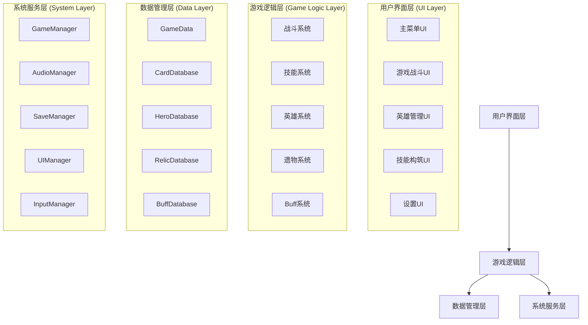
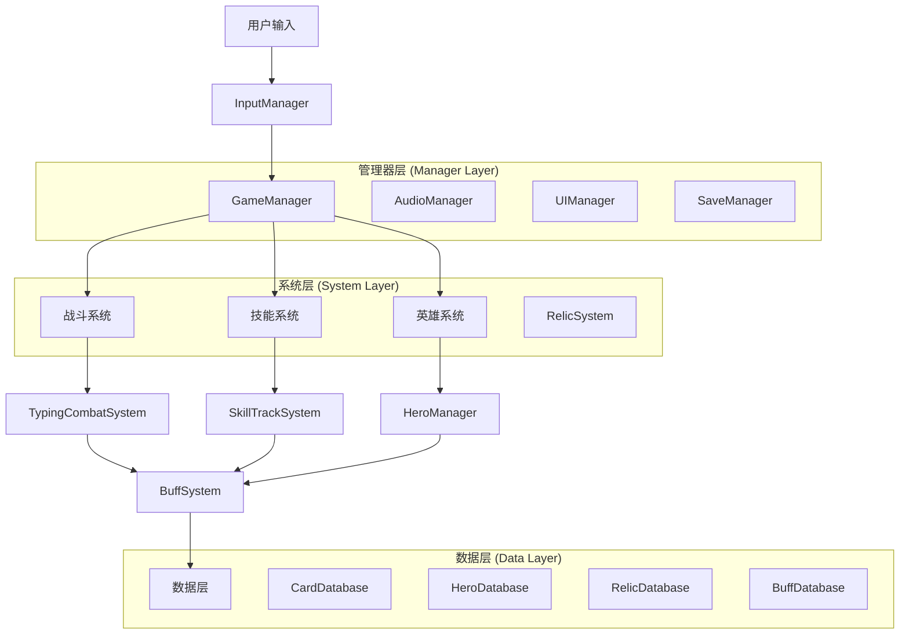
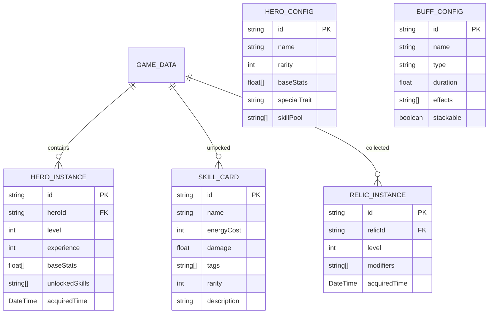

# Code Rogue: 代码深渊 - 技术架构文档

## 1. 架构设计



## 2. 技术描述

**前端游戏引擎**：Godot 4.4+ (C# .NET 6.0)
**开发语言**：C# 主要逻辑，GDScript 辅助脚本
**UI框架**：Godot内置UI系统 (Control节点)
**数据存储**：JSON文件 + Godot Resource系统
**版本控制**：Git + Git LFS
**构建系统**：Godot Export Templates
**目标平台**：Windows (Steam)

## 3. 路由定义

游戏采用场景切换系统，主要场景路由如下：

| 场景路径                           | 用途    | 描述                    |
| ------------------------------ | ----- | --------------------- |
| /Scenes/UI/MainMenu.tscn       | 主菜单   | 游戏启动后的主界面，提供模式选择和设置入口 |
| /Scenes/Game/GameScene.tscn    | 游戏主场景 | 核心游戏玩法场景，包含战斗系统和UI    |
| /Scenes/UI/HeroManagement.tscn | 英雄管理  | 英雄收集、查看和配置界面          |
| /Scenes/UI/SkillBuild.tscn     | 技能构筑  | 卡牌选择和轨道配置界面           |
| /Scenes/UI/Settings.tscn       | 设置界面  | 游戏设置、音频和视觉配置          |
| /Scenes/UI/GameOver.tscn       | 游戏结束  | 结算界面，显示成绩和奖励          |

## 4. 核心系统API定义

### 4.1 战斗系统API

**打字战斗系统**

```csharp
// 输入处理
POST /api/combat/input
```

请求参数：

| 参数名        | 参数类型   | 是否必需 | 描述    |
| ---------- | ------ | ---- | ----- |
| character  | string | true | 输入的字符 |
| timestamp  | long   | true | 输入时间戳 |
| targetWord | string | true | 目标单词  |

响应参数：

| 参数名          | 参数类型    | 描述     |
| ------------ | ------- | ------ |
| isCorrect    | boolean | 输入是否正确 |
| damage       | float   | 造成的伤害值 |
| comboCount   | int     | 当前连击数  |
| energyGained | float   | 获得的能量值 |

**技能释放系统**

```csharp
// 技能释放
POST /api/combat/skill/cast
```

请求参数：

| 参数名            | 参数类型    | 是否必需  | 描述           |
| -------------- | ------- | ----- | ------------ |
| trackIndex     | int     | true  | 技能轨道索引 (0-3) |
| skillId        | string  | true  | 技能卡牌ID       |
| targetPosition | Vector2 | false | 目标位置（如果需要）   |

响应参数：

| 参数名          | 参数类型           | 描述       |
| ------------ | -------------- | -------- |
| success      | boolean        | 技能是否成功释放 |
| energyCost   | float          | 消耗的能量值   |
| cooldownTime | float          | 冷却时间     |
| effects      | SkillEffect\[] | 技能效果列表   |

### 4.2 数据管理API

**游戏数据保存**

```csharp
// 保存游戏数据
POST /api/data/save
```

请求参数：

| 参数名      | 参数类型     | 是否必需  | 描述         |
| -------- | -------- | ----- | ---------- |
| gameData | GameData | true  | 完整的游戏数据对象  |
| saveSlot | int      | false | 存档槽位 (默认0) |

响应参数：

| 参数名      | 参数类型     | 描述     |
| -------- | -------- | ------ |
| success  | boolean  | 保存是否成功 |
| saveTime | DateTime | 保存时间   |
| fileSize | long     | 存档文件大小 |

**配置数据加载**

```csharp
// 加载配置数据
GET /api/data/config/{configType}
```

请求参数：

| 参数名        | 参数类型   | 是否必需 | 描述                               |
| ---------- | ------ | ---- | -------------------------------- |
| configType | string | true | 配置类型 (cards/heroes/relics/buffs) |

响应示例：

```json
{
  "configType": "cards",
  "version": "1.0.0",
  "data": [
    {
      "id": "skill_001",
      "name": "代码风暴",
      "energyCost": 30,
      "damage": 200,
      "tags": ["攻击", "单体"]
    }
  ]
}
```

## 5. 系统架构图



## 6. 数据模型

### 6.1 数据模型定义



### 6.2 数据定义语言

**游戏数据表 (GameData)**

```csharp
// 创建游戏数据结构
public class GameData : Node
{
    [Export] public int PlayerLevel { get; set; } = 1;
    [Export] public long TotalExperience { get; set; } = 0;
    [Export] public Dictionary<string, HeroInstance> Heroes { get; set; } = new();
    [Export] public Dictionary<string, int> UnlockedCards { get; set; } = new();
    [Export] public Dictionary<string, RelicInstance> Relics { get; set; } = new();
    [Export] public Dictionary<string, bool> Achievements { get; set; } = new();
    [Export] public GameSettings Settings { get; set; } = new();
    [Export] public DateTime LastSaveTime { get; set; } = DateTime.Now;
}

// 创建索引
// 游戏数据按玩家ID索引
// 英雄实例按英雄ID索引
// 技能卡牌按稀有度和标签索引

// 初始化数据
INSERT INTO game_progress (player_level, total_experience, last_save_time)
VALUES (1, 0, NOW());

INSERT INTO hero_instances (id, hero_id, level, experience, base_stats)
VALUES ('starter_hero', 'code_expert', 1, 0, '[100, 50, 25, 10]');

INSERT INTO skill_cards (id, name, energy_cost, damage, tags, rarity)
VALUES 
('skill_001', '代码风暴', 30, 200, '["攻击", "单体"]', 1),
('skill_002', '数据护盾', 25, 0, '["防御", "护盾"]', 1),
('skill_003', '系统超频', 40, 0, '["增益", "加速"]', 2);
```

**英雄配置表 (HeroConfig)**

```csharp
// 创建英雄配置表
CREATE TABLE hero_configs (
    id VARCHAR(50) PRIMARY KEY,
    name VARCHAR(100) NOT NULL,
    rarity INTEGER NOT NULL CHECK (rarity BETWEEN 1 AND 4),
    base_attack REAL NOT NULL DEFAULT 100.0,
    base_health REAL NOT NULL DEFAULT 500.0,
    base_energy_regen REAL NOT NULL DEFAULT 1.0,
    special_trait TEXT NOT NULL,
    skill_pool TEXT NOT NULL, -- JSON数组
    created_at TIMESTAMP DEFAULT CURRENT_TIMESTAMP
);

// 创建索引
CREATE INDEX idx_hero_rarity ON hero_configs(rarity);
CREATE INDEX idx_hero_name ON hero_configs(name);

// 初始化英雄数据
INSERT INTO hero_configs (id, name, rarity, base_attack, base_health, base_energy_regen, special_trait, skill_pool)
VALUES 
('code_expert', '代码专家', 2, 120, 450, 1.2, '每3次技能攻击后，下一次技能伤害提升50%', '["skill_001", "skill_002", "skill_003"]'),
('system_guardian', '系统守护者', 2, 80, 600, 1.0, '护盾被击破时，恢复10%最大生命值', '["skill_002", "skill_004", "skill_005"]'),
('architect_master', '架构大师', 3, 100, 500, 1.1, '场上每有一个召唤物，所有召唤物伤害提升10%', '["skill_006", "skill_007", "skill_008"]');
```

**技能卡牌表 (SkillCards)**

```csharp
// 创建技能卡牌表
CREATE TABLE skill_cards (
    id VARCHAR(50) PRIMARY KEY,
    name VARCHAR(100) NOT NULL,
    energy_cost INTEGER NOT NULL CHECK (energy_cost > 0),
    base_damage REAL NOT NULL DEFAULT 0,
    skill_type VARCHAR(20) NOT NULL CHECK (skill_type IN ('攻击', '防御', '增益', '控制', '召唤')),
    tags TEXT NOT NULL, -- JSON数组
    rarity INTEGER NOT NULL CHECK (rarity BETWEEN 1 AND 4),
    description TEXT NOT NULL,
    effect_data TEXT NOT NULL, -- JSON对象
    created_at TIMESTAMP DEFAULT CURRENT_TIMESTAMP
);

// 创建索引
CREATE INDEX idx_skill_rarity ON skill_cards(rarity);
CREATE INDEX idx_skill_type ON skill_cards(skill_type);
CREATE INDEX idx_skill_energy_cost ON skill_cards(energy_cost);

// 初始化技能数据
INSERT INTO skill_cards (id, name, energy_cost, base_damage, skill_type, tags, rarity, description, effect_data)
VALUES 
('skill_001', '代码风暴', 30, 200, '攻击', '["攻击", "单体", "代码专家"]', 1, '对单个敌人造成200%攻击力的伤害', '{"targetType": "single", "damageMultiplier": 2.0}'),
('skill_002', '数据护盾', 25, 0, '防御', '["防御", "护盾", "系统守护"]', 1, '生成相当于最大生命值30%的护盾', '{"shieldPercent": 0.3, "duration": 10}'),
('skill_003', '系统超频', 40, 0, '增益', '["增益", "加速", "代码专家"]', 2, '10秒内打字速度提升30%', '{"speedBonus": 0.3, "duration": 10}');
```

